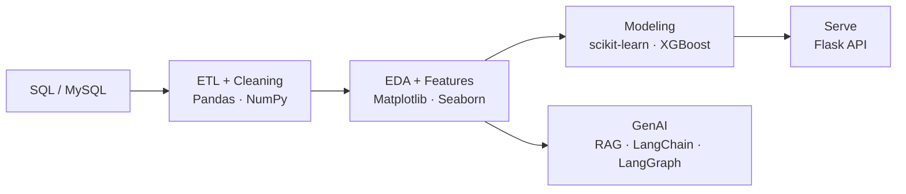

<div align="center">


<a href="https://git.io/typing-svg">
  
</a>

<br/><br/>


</div>

---

## About Me

```python
class Prajwal:
    name    = "Prajwal Ghotkar"
    roles   = ["Data Scientist", "ML Engineer", "SQL Developer"]
    stack   = ["Python", "SQL", "scikit-learn", "XGBoost", "LangChain", "LangGraph"]
    exploring = ["RAG", "Agentic AI", "LLMs", "Model Deployment with Flask"]
    fun_fact  = "The world is one big data problem"

    def mission(self):
        return "Turn messy data into intelligent decisions."

print(Prajwal().mission())
```

<table>
<tr>
<td width="50%">

### Currently
- Mastering **Data Science & ML** end to end
- Building **RAG** and **Agentic AI** apps
- Working with **LangChain** and **LangGraph**
- Writing optimized **SQL** for analytics

</td>
<td width="50%">

### Goals
- Work as **Data Scientist / ML Engineer**
- Ship **production-ready ML pipelines**
- Build **LLM-powered products**
- Tell stories with data

</td>
</tr>
</table>

---

## Skills

### Programming Languages


### Machine Learning & Deep Learning
`Supervised & Unsupervised Learning` · `Regression` · `Classification` · `Clustering` · `Linear Regression` · `Logistic Regression` · `Decision Trees` · `Random Forest` · `XGBoost` · `SVM` · `KNN` · `K-Means Clustering` · `Model Evaluation` · `Hyperparameter Tuning` · `A/B Testing` · `Hypothesis Testing`

### Generative AI & LLMs


### Data Analysis
`Data Cleaning` · `Data Wrangling` · `Exploratory Data Analysis (EDA)` · `Statistical Analysis` · `Feature Engineering` · `Predictive Analytics` · `ETL Pipelines`

### Tools & Technologies


---

## My Workflow



---

## Featured Projects

> Replace these with your real repositories.

| Project | Description | Tech |
|---|---|---|
|  **ML Prediction Pipeline** | End-to-end: cleaning, feature engineering, training, evaluation | `Python` `scikit-learn` `XGBoost` |
|  **RAG Chatbot** | Ask questions over your own documents with retrieval + LLM | `LangChain` `RAG` `LLMs` |
|  **Agentic AI Workflow** | Multi-step AI agent with tools and state | `LangGraph` `LangChain` |
|  **SQL Analytics Project** | Complex joins, window functions, business insights | `MySQL` `SQL` |
|  **EDA & A/B Testing** | Hypothesis testing and statistical storytelling | `Pandas` `Seaborn` `SciPy` |
|  **ML Model API** | Trained model served as a REST API | `Flask` `Python` |

---

## GitHub Stats

<div align="center">


<br/>


<br/>


</div>

---

## Let's Connect

<div align="center">

<a href="mailto:pmghotkar05@gmail.com"></a>
<a href="https://linkedin.com/in/prajwal-ghotkar-9618272a5"></a>
<a href="https://www.instagram.com/prajwalghotkar_02/"></a>
<a href="https://github.com/prajwalghotkar"></a>

<br/><br/>


</div>


