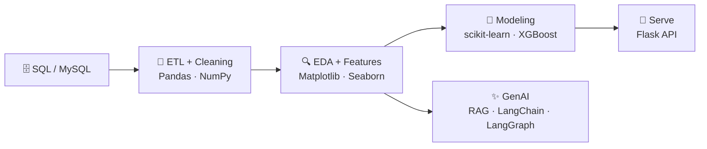

<div align="center">

<svg xmlns="http://www.w3.org/2000/svg" viewBox="0 0 1000 480" width="1000" height="480" font-family="'Courier New', Consolas, monospace" xmlns:c2pa="http://c2pa.org/manifest"><metadata><c2pa:manifest>AAAWgmp1bWIAAAAeanVtZGMycGEAEQAQgAAAqgA4m3EDYzJwYQAAABZcanVtYgAAAEdqdW1kYzJtYQARABCAAACqADibcQN1cm46YzJwYTpmNjBlNzJjZS1kODcyLTQwNzUtOGVlOS02YjQwOTRmNjgyZTEAAAADl2p1bWIAAAApanVtZGMyYXMAEQAQgAAAqgA4m3EDYzJwYS5hc3NlcnRpb25zAAAAALxqdW1iAAAARGp1bWRjYm9yABEAEIAAAKoAOJtxE2MycGEuaW5ncmVkaWVudC52MwAAAAAYYzJzaF3RI3mNYwEuyDEqjMLxF5AAAABwY2JvcqNpZGM6Zm9ybWF0bWltYWdlL3N2Zyt4bWxqaW5zdGFuY2VJRHgseG1wOmlpZDo1M2Y3YjRjOS0zZmRjLTQ0MjQtOThjYy0xYTI5MDYzMmFlZWNscmVsYXRpb25zaGlwaHBhcmVudE9mAAAB4mp1bWIAAABBanVtZGNib3IAEQAQgAAAqgA4m3ETYzJwYS5hY3Rpb25zLnYyAAAAABhjMnNowlWYRZIl8PHpQw0MplZPmwAAAZljYm9yomdhY3Rpb25zgqJmYWN0aW9ua2MycGEub3BlbmVkanBhcmFtZXRlcnOha2luZ3JlZGllbnRzgaJjdXJseC1zZWxmI2p1bWJmPWMycGEuYXNzZXJ0aW9ucy9jMnBhLmluZ3JlZGllbnQudjNkaGFzaFggF5ouDtOGxwqmtjb1g1wQ1p7Qrly1MzxV46HQ7LwAig+kZmFjdGlvbngdY29tLmFudGhyb3BpYy5jbGF1ZGUucHJvdmlkZWRqcGFyYW1ldGVyc6F4H2NvbS5hbnRocm9waWMub3JpZ2luLWNvbmZpZGVuY2VndW5rbm93bmtkZXNjcmlwdGlvbnhmQ2xhdWRlIHByb3ZpZGVkIHRoaXMgZmlsZSBhdCB0aGUgcmVxdWVzdCBvZiBhIHVzZXIgYW5kIG1heSBoYXZlIGNyZWF0ZWQgb3IgbW9kaWZpZWQgdGhlIGZpbGUgY29udGVudHMubXNvZnR3YXJlQWdlbnShZG5hbWVmQ2xhdWRlcmFsbEFjdGlvbnNJbmNsdWRlZPUAAADIanVtYgAAAEBqdW1kY2JvcgARABCAAACqADibcRNjMnBhLmhhc2guZGF0YQAAAAAYYzJzaB3iZpy4xvyjlkiwcHpU7rYAAACAY2JvcqVjYWxnZnNoYTI1NmNwYWRNAAAAAAAAAAAAAAAAAGRoYXNoWCCIehhDrFq2pjU9KXORhDJGXMX8zpgX4ZQTz7Ld6bGa1GRuYW1lbmp1bWJmIG1hbmlmZXN0amV4Y2x1c2lvbnOBomVzdGFydBjJZmxlbmd0aBkeBAAAAj5qdW1iAAAAJ2p1bWRjMmNsABEAEIAAAKoAOJtxA2MycGEuY2xhaW0udjIAAAACD2Nib3KlY2FsZ2ZzaGEyNTZpc2lnbmF0dXJleE1zZWxmI2p1bWJmPS9jMnBhL3VybjpjMnBhOmY2MGU3MmNlLWQ4NzItNDA3NS04ZWU5LTZiNDA5NGY2ODJlMS9jMnBhLnNpZ25hdHVyZWppbnN0YW5jZUlEeCx4bXA6aWlkOjE0NTkxZTRhLTI5MDQtNDMwZi1hMzg0LTA0MmQzYzIyNmJlZHJjcmVhdGVkX2Fzc2VydGlvbnODomN1cmx4LXNlbGYjanVtYmY9YzJwYS5hc3NlcnRpb25zL2MycGEuaW5ncmVkaWVudC52M2RoYXNoWCAXmi4O04bHCqa2NvWDXBDWntCuXLUzPFXjodDsvACKD6JjdXJseCpzZWxmI2p1bWJmPWMycGEuYXNzZXJ0aW9ucy9jMnBhLmFjdGlvbnMudjJkaGFzaFggamV7ArcnnXv7SmDbXTx3/+QBOH2oCBR/HolRGVUAg5KiY3VybHgpc2VsZiNqdW1iZj1jMnBhLmFzc2VydGlvbnMvYzJwYS5oYXNoLmRhdGFkaGFzaFggpCXGWk0HO1N/1qO19LLDCVNBjByb4UmBZfy19ioCujJ0Y2xhaW1fZ2VuZXJhdG9yX2luZm+jZG5hbWVvQW50aHJvcGljIEZpbGVzZ3ZlcnNpb25lMS4wLjBrc3BlY1ZlcnNpb25lMi40LjAAABA4anVtYgAAAChqdW1kYzJjcwARABCAAACqADibcQNjMnBhLnNpZ25hdHVyZQAAABAIY2JvctKEWQISogEmGCFZAgowggIGMIIBjaADAgECAhRA5aAK7sI50L64g/oGQgU9Z1UTADAKBggqhkjOPQQDAzBJMRcwFQYDVQQKEw5BbnRocm9waWMsIFBCQzEuMCwGA1UEAxMlQW50aHJvcGljIENvbnRlbnQgQ3JlZGVudGlhbHMgUm9vdCBDQTAeFw0yNjA4MDcxODQzNTZaFw0yODA4MDYxOTQzNTZaMEQxFzAVBgNVBAoTDkFudGhyb3BpYywgUEJDMSkwJwYDVQQDEyBBbnRocm9waWMgQ2xhdWRlIENvbnRlbnQgU2lnbmluZzBZMBMGByqGSM49AgEGCCqGSM49AwEHA0IABJh6CmvLUBgFFNU0vUKlOVtE6djd17L5SuwX0LemFisBM3dkd/3cyjxFA3Qo5S46fX0/ihY0VZ7mfb9KF703t5OjWDBWMA4GA1UdDwEB/wQEAwIHgDAVBgNVHSUEDjAMBgorBgEEAYPoXgIBMAwGA1UdEwEB/wQCMAAwHwYDVR0jBBgwFoAUzlHiBIFOZFsj+OPEz5o+nMHXXMIwCgYIKoZIzj0EAwMDZwAwZAIwMXMdFJ4BetLLVY7ORuE9noqbbAZOZn/aArXyTwFAZfKrPzxF2vPoJNf1+UCdg1XGAjBwX1zd9WGqYkqmL5SFqw1QySjr1zJfpJM9+1rdDwSPLMOPOjKuiXjoU/pUUeG9RwmhY3BhZFkNngAAAAAAAAAAAAAAAAAAAAAAAAAAAAAAAAAAAAAAAAAAAAAAAAAAAAAAAAAAAAAAAAAAAAAAAAAAAAAAAAAAAAAAAAAAAAAAAAAAAAAAAAAAAAAAAAAAAAAAAAAAAAAAAAAAAAAAAAAAAAAAAAAAAAAAAAAAAAAAAAAAAAAAAAAAAAAAAAAAAAAAAAAAAAAAAAAAAAAAAAAAAAAAAAAAAAAAAAAAAAAAAAAAAAAAAAAAAAAAAAAAAAAAAAAAAAAAAAAAAAAAAAAAAAAAAAAAAAAAAAAAAAAAAAAAAAAAAAAAAAAAAAAAAAAAAAAAAAAAAAAAAAAAAAAAAAAAAAAAAAAAAAAAAAAAAAAAAAAAAAAAAAAAAAAAAAAAAAAAAAAAAAAAAAAAAAAAAAAAAAAAAAAAAAAAAAAAAAAAAAAAAAAAAAAAAAAAAAAAAAAAAAAAAAAAAAAAAAAAAAAAAAAAAAAAAAAAAAAAAAAAAAAAAAAAAAAAAAAAAAAAAAAAAAAAAAAAAAAAAAAAAAAAAAAAAAAAAAAAAAAAAAAAAAAAAAAAAAAAAAAAAAAAAAAAAAAAAAAAAAAAAAAAAAAAAAAAAAAAAAAAAAAAAAAAAAAAAAAAAAAAAAAAAAAAAAAAAAAAAAAAAAAAAAAAAAAAAAAAAAAAAAAAAAAAAAAAAAAAAAAAAAAAAAAAAAAAAAAAAAAAAAAAAAAAAAAAAAAAAAAAAAAAAAAAAAAAAAAAAAAAAAAAAAAAAAAAAAAAAAAAAAAAAAAAAAAAAAAAAAAAAAAAAAAAAAAAAAAAAAAAAAAAAAAAAAAAAAAAAAAAAAAAAAAAAAAAAAAAAAAAAAAAAAAAAAAAAAAAAAAAAAAAAAAAAAAAAAAAAAAAAAAAAAAAAAAAAAAAAAAAAAAAAAAAAAAAAAAAAAAAAAAAAAAAAAAAAAAAAAAAAAAAAAAAAAAAAAAAAAAAAAAAAAAAAAAAAAAAAAAAAAAAAAAAAAAAAAAAAAAAAAAAAAAAAAAAAAAAAAAAAAAAAAAAAAAAAAAAAAAAAAAAAAAAAAAAAAAAAAAAAAAAAAAAAAAAAAAAAAAAAAAAAAAAAAAAAAAAAAAAAAAAAAAAAAAAAAAAAAAAAAAAAAAAAAAAAAAAAAAAAAAAAAAAAAAAAAAAAAAAAAAAAAAAAAAAAAAAAAAAAAAAAAAAAAAAAAAAAAAAAAAAAAAAAAAAAAAAAAAAAAAAAAAAAAAAAAAAAAAAAAAAAAAAAAAAAAAAAAAAAAAAAAAAAAAAAAAAAAAAAAAAAAAAAAAAAAAAAAAAAAAAAAAAAAAAAAAAAAAAAAAAAAAAAAAAAAAAAAAAAAAAAAAAAAAAAAAAAAAAAAAAAAAAAAAAAAAAAAAAAAAAAAAAAAAAAAAAAAAAAAAAAAAAAAAAAAAAAAAAAAAAAAAAAAAAAAAAAAAAAAAAAAAAAAAAAAAAAAAAAAAAAAAAAAAAAAAAAAAAAAAAAAAAAAAAAAAAAAAAAAAAAAAAAAAAAAAAAAAAAAAAAAAAAAAAAAAAAAAAAAAAAAAAAAAAAAAAAAAAAAAAAAAAAAAAAAAAAAAAAAAAAAAAAAAAAAAAAAAAAAAAAAAAAAAAAAAAAAAAAAAAAAAAAAAAAAAAAAAAAAAAAAAAAAAAAAAAAAAAAAAAAAAAAAAAAAAAAAAAAAAAAAAAAAAAAAAAAAAAAAAAAAAAAAAAAAAAAAAAAAAAAAAAAAAAAAAAAAAAAAAAAAAAAAAAAAAAAAAAAAAAAAAAAAAAAAAAAAAAAAAAAAAAAAAAAAAAAAAAAAAAAAAAAAAAAAAAAAAAAAAAAAAAAAAAAAAAAAAAAAAAAAAAAAAAAAAAAAAAAAAAAAAAAAAAAAAAAAAAAAAAAAAAAAAAAAAAAAAAAAAAAAAAAAAAAAAAAAAAAAAAAAAAAAAAAAAAAAAAAAAAAAAAAAAAAAAAAAAAAAAAAAAAAAAAAAAAAAAAAAAAAAAAAAAAAAAAAAAAAAAAAAAAAAAAAAAAAAAAAAAAAAAAAAAAAAAAAAAAAAAAAAAAAAAAAAAAAAAAAAAAAAAAAAAAAAAAAAAAAAAAAAAAAAAAAAAAAAAAAAAAAAAAAAAAAAAAAAAAAAAAAAAAAAAAAAAAAAAAAAAAAAAAAAAAAAAAAAAAAAAAAAAAAAAAAAAAAAAAAAAAAAAAAAAAAAAAAAAAAAAAAAAAAAAAAAAAAAAAAAAAAAAAAAAAAAAAAAAAAAAAAAAAAAAAAAAAAAAAAAAAAAAAAAAAAAAAAAAAAAAAAAAAAAAAAAAAAAAAAAAAAAAAAAAAAAAAAAAAAAAAAAAAAAAAAAAAAAAAAAAAAAAAAAAAAAAAAAAAAAAAAAAAAAAAAAAAAAAAAAAAAAAAAAAAAAAAAAAAAAAAAAAAAAAAAAAAAAAAAAAAAAAAAAAAAAAAAAAAAAAAAAAAAAAAAAAAAAAAAAAAAAAAAAAAAAAAAAAAAAAAAAAAAAAAAAAAAAAAAAAAAAAAAAAAAAAAAAAAAAAAAAAAAAAAAAAAAAAAAAAAAAAAAAAAAAAAAAAAAAAAAAAAAAAAAAAAAAAAAAAAAAAAAAAAAAAAAAAAAAAAAAAAAAAAAAAAAAAAAAAAAAAAAAAAAAAAAAAAAAAAAAAAAAAAAAAAAAAAAAAAAAAAAAAAAAAAAAAAAAAAAAAAAAAAAAAAAAAAAAAAAAAAAAAAAAAAAAAAAAAAAAAAAAAAAAAAAAAAAAAAAAAAAAAAAAAAAAAAAAAAAAAAAAAAAAAAAAAAAAAAAAAAAAAAAAAAAAAAAAAAAAAAAAAAAAAAAAAAAAAAAAAAAAAAAAAAAAAAAAAAAAAAAAAAAAAAAAAAAAAAAAAAAAAAAAAAAAAAAAAAAAAAAAAAAAAAAAAAAAAAAAAAAAAAAAAAAAAAAAAAAAAAAAAAAAAAAAAAAAAAAAAAAAAAAAAAAAAAAAAAAAAAAAAAAAAAAAAAAAAAAAAAAAAAAAAAAAAAAAAAAAAAAAAAAAAAAAAAAAAAAAAAAAAAAAAAAAAAAAAAAAAAAAAAAAAAAAAAAAAAAAAAAAAAAAAAAAAAAAAAAAAAAAAAAAAAAAAAAAAAAAAAAAAAAAAAAAAAAAAAAAAAAAAAAAAAAAAAAAAAAAAAAAAAAAAAAAAAAAAAAAAAAAAAAAAAAAAAAAAAAAAAAAAAAAAAAAAAAAAAAAAAAAAAAAAAAAAAAAAAAAAAAAAAAAAAAAAAAAAAAAAAAAAAAAAAAAAAAAAAAAAAAAAAAAAAAAAAAAAAAAAAAAAAAAAAAAAAAAAAAAAAAAAAAAAAAAAAAAAAAAAAAAAAAAAAAAAAAAAAAAAAAAAAAAAAAAAAAAAAAAAAAAAAAAAAAAAAAAAAAAAAAAAAAAAAAAAAAAAAAAAAAAAAAAAAAAAAAAAAAAAAAAAAAAAAAAAAAAAAAAAAAAAAAAAAAAAAAAAAAAAAAAAAAAAAAAAAAAAAAAAAAAAAAAAAAAAAAAAAAAAAAAAAAAAAAAAAAAAAAAAAAAAAAAAAAAAAAAAAAAAAAAAAAAAAAAAAAAAAAAAAAAAAAAAAAAAAAAAAAAAAAAAAAAAAAAAAAAAAAAAAAAAAAAAAAAAAAAAAAAAAAAAAAAAAAAAAAAAAAAAAAAAAAAAAAAAAAAAAAAAAAAAAAAAAAAAAAAAAAAAAAAAAAAAAAAAAAAAAAAAAAAAAAAAAAAAAAAAAAAAAAAAAAAAAAAAAAAAAAAAAAAAAAAAAAAAAAAAAAAAAAAAAAAAAAAAAAAAAAAAAAAAAAAAAAAAAAAAAAAAAAAAAAAAAAAAAAAAAAAAAAAAAAAAAAAAAAAAAAAAAAAAAAAAAAAAAAAAAAAAAAAAAAAAAAAAAAAAAAAAAAAAAAAAAAAAAAAAAAAAAAAAAAAAAAAAAAAAAAAAAAAAAAAAAAAAAAAAAAAAAAAAAAAAAAAAAAAAAAAAAAAAAAAAAAAAAAAAAAAAAAAAAAAAAAAAAAAAAAAAAAAAAAAAAAAAAAAAAAAAAAAAAAAAAAAAAAAAAAAAAAAAAAAAAAAAAAAAAAAAAAAAAAAAAAAAAAAAAAAAAAAAAAAAAAAAAAAAAAAAAAAAAAAAAAAAAAAAAAAAAAAAAAAAAAAAAAAAAAAAAAAAAAAAAAAAAAAAAAAAAAAAAAAAAAAAAAAAAAAAAAAAAAAAAAAAAAAAAAAAAAAAAAAAAAAAAAAAAAAAAAAAAAAAAAAAAAAAAAAAAAAAAAAAAAAAAAAAAAAAAAAAAAAAAAAAAAAAAAAAAAAAAAAAAAAAAAAAAAAAAAAAAAAAAAAAAAAAAAAAAAAAAAAAAAAAAAAAAAAAAAAAAAAAAAAAAAAAAAAAAAAAAAAAAAAAAAAAAAAAAAAAAAAAAAAAAAAAAAAAAAAAAAAAAAAAAAAAAAAAAAAAAAAAAAAAAAAAAAAAAAAAAAAAAAAAAAAAAAAAAAAAAAAAAAAAAAAAAAAAAAAAAAAAAAAAAAAAAAAAAAAAAAAAAAAAAAAAAAAAAAAAAAAAAAAAAAAAAAAAAAAAAAAAAAAAAAAAAAAAAAAAAAAAAAAAAAAAAAAAAAAAAAAAAAAAAAAAAAAAAAAAAAAAAAAAAAAAAAAAAAAAAAAAAAAAAAAAAAPZYQIPsjZS/ukjBKbO4qJ4NXLFv4r6O6lupc0zDH0Agqfe4y5ocRTznJ7X2StIyXyyxVcHvONYX7eEAWLQCpWjnXRo=</c2pa:manifest></metadata>
<defs>
<radialGradient id="bg" cx="50%" cy="55%" r="75%"><stop offset="0" stop-color="#0b1730"/><stop offset="0.6" stop-color="#060d1f"/><stop offset="1" stop-color="#02050e"/></radialGradient>
<linearGradient id="tg" x1="0" x2="1"><stop offset="0" stop-color="#22d3ee"/><stop offset="0.5" stop-color="#60a5fa"/><stop offset="1" stop-color="#a78bfa"/></linearGradient>
<radialGradient id="orb" cx="35%" cy="35%" r="75%"><stop offset="0" stop-color="#e0f2fe"/><stop offset="0.45" stop-color="#22d3ee"/><stop offset="1" stop-color="#6d28d9"/></radialGradient>
<filter id="glow" x="-50%" y="-50%" width="200%" height="200%"><feGaussianBlur stdDeviation="3" result="b"/><feMerge><feMergeNode in="b"/><feMergeNode in="SourceGraphic"/></feMerge></filter>
<filter id="neb" x="-50%" y="-50%" width="200%" height="200%"><feGaussianBlur stdDeviation="45"/></filter>
<clipPath id="clip"><rect width="1000" height="480" rx="20"/></clipPath>
</defs>
<g clip-path="url(#clip)">
<rect width="1000" height="480" fill="url(#bg)"/>
<ellipse cx="220" cy="200" rx="200" ry="90" fill="#0e75b6" opacity="0.28" filter="url(#neb)"><animateTransform attributeName="transform" type="translate" values="0,0;30,12;0,0" dur="18s" repeatCount="indefinite"/></ellipse>
<ellipse cx="760" cy="330" rx="230" ry="100" fill="#7c3aed" opacity="0.28" filter="url(#neb)"><animateTransform attributeName="transform" type="translate" values="0,0;-35,12;0,0" dur="22s" repeatCount="indefinite"/></ellipse>
<ellipse cx="520" cy="120" rx="170" ry="70" fill="#06b6d4" opacity="0.28" filter="url(#neb)"><animateTransform attributeName="transform" type="translate" values="0,0;25,12;0,0" dur="16s" repeatCount="indefinite"/></ellipse>
<circle cx="452.9" cy="268.1" r="1.2" fill="#cfe8ff"><animate attributeName="opacity" values="0.1;0.95;0.1" dur="3.4s" begin="3.4s" repeatCount="indefinite"/></circle>
<circle cx="193.0" cy="382.8" r="1.2" fill="#cfe8ff"><animate attributeName="opacity" values="0.1;0.95;0.1" dur="3.9s" begin="3.2s" repeatCount="indefinite"/></circle>
<circle cx="98.2" cy="147.6" r="0.5" fill="#cfe8ff"><animate attributeName="opacity" values="0.1;0.95;0.1" dur="3.6s" begin="3.6s" repeatCount="indefinite"/></circle>
<circle cx="633.1" cy="284.9" r="1.2" fill="#cfe8ff"><animate attributeName="opacity" values="0.1;0.95;0.1" dur="4.9s" begin="2.6s" repeatCount="indefinite"/></circle>
<circle cx="614.4" cy="79.0" r="0.5" fill="#cfe8ff"><animate attributeName="opacity" values="0.1;0.95;0.1" dur="4.5s" begin="0.3s" repeatCount="indefinite"/></circle>
<circle cx="40.3" cy="418.4" r="1.6" fill="#cfe8ff"><animate attributeName="opacity" values="0.1;0.95;0.1" dur="2.1s" begin="1.9s" repeatCount="indefinite"/></circle>
<circle cx="441.1" cy="400.9" r="1.6" fill="#cfe8ff"><animate attributeName="opacity" values="0.1;0.95;0.1" dur="2.7s" begin="1.2s" repeatCount="indefinite"/></circle>
<circle cx="9.5" cy="44.9" r="0.9" fill="#cfe8ff"><animate attributeName="opacity" values="0.1;0.95;0.1" dur="3.2s" begin="2.2s" repeatCount="indefinite"/></circle>
<circle cx="927.4" cy="44.1" r="0.9" fill="#cfe8ff"><animate attributeName="opacity" values="0.1;0.95;0.1" dur="2.9s" begin="0.9s" repeatCount="indefinite"/></circle>
<circle cx="291.1" cy="38.0" r="0.5" fill="#cfe8ff"><animate attributeName="opacity" values="0.1;0.95;0.1" dur="3.2s" begin="3.4s" repeatCount="indefinite"/></circle>
<circle cx="387.6" cy="455.3" r="0.5" fill="#cfe8ff"><animate attributeName="opacity" values="0.1;0.95;0.1" dur="2.6s" begin="3.7s" repeatCount="indefinite"/></circle>
<circle cx="56.8" cy="181.5" r="1.2" fill="#cfe8ff"><animate attributeName="opacity" values="0.1;0.95;0.1" dur="3.3s" begin="2.3s" repeatCount="indefinite"/></circle>
<circle cx="201.5" cy="322.2" r="0.9" fill="#cfe8ff"><animate attributeName="opacity" values="0.1;0.95;0.1" dur="2.3s" begin="1.3s" repeatCount="indefinite"/></circle>
<circle cx="959.4" cy="361.3" r="0.5" fill="#cfe8ff"><animate attributeName="opacity" values="0.1;0.95;0.1" dur="2.4s" begin="2.8s" repeatCount="indefinite"/></circle>
<circle cx="15.8" cy="223.5" r="1.2" fill="#cfe8ff"><animate attributeName="opacity" values="0.1;0.95;0.1" dur="2.5s" begin="2.2s" repeatCount="indefinite"/></circle>
<circle cx="448.0" cy="94.6" r="0.7" fill="#cfe8ff"><animate attributeName="opacity" values="0.1;0.95;0.1" dur="3.3s" begin="1.5s" repeatCount="indefinite"/></circle>
<circle cx="395.9" cy="470.3" r="0.5" fill="#cfe8ff"><animate attributeName="opacity" values="0.1;0.95;0.1" dur="2.8s" begin="3.9s" repeatCount="indefinite"/></circle>
<circle cx="800.4" cy="147.9" r="0.5" fill="#cfe8ff"><animate attributeName="opacity" values="0.1;0.95;0.1" dur="2.6s" begin="1.6s" repeatCount="indefinite"/></circle>
<circle cx="850.8" cy="306.7" r="0.5" fill="#cfe8ff"><animate attributeName="opacity" values="0.1;0.95;0.1" dur="2.1s" begin="0.6s" repeatCount="indefinite"/></circle>
<circle cx="442.1" cy="9.5" r="1.6" fill="#cfe8ff"><animate attributeName="opacity" values="0.1;0.95;0.1" dur="3.0s" begin="1.2s" repeatCount="indefinite"/></circle>
<circle cx="77.7" cy="47.4" r="1.6" fill="#cfe8ff"><animate attributeName="opacity" values="0.1;0.95;0.1" dur="3.9s" begin="0.1s" repeatCount="indefinite"/></circle>
<circle cx="370.0" cy="297.4" r="0.7" fill="#cfe8ff"><animate attributeName="opacity" values="0.1;0.95;0.1" dur="4.9s" begin="1.9s" repeatCount="indefinite"/></circle>
<circle cx="573.8" cy="412.3" r="0.7" fill="#cfe8ff"><animate attributeName="opacity" values="0.1;0.95;0.1" dur="3.9s" begin="1.2s" repeatCount="indefinite"/></circle>
<circle cx="231.1" cy="291.9" r="0.7" fill="#cfe8ff"><animate attributeName="opacity" values="0.1;0.95;0.1" dur="2.5s" begin="2.5s" repeatCount="indefinite"/></circle>
<circle cx="553.4" cy="327.9" r="1.2" fill="#cfe8ff"><animate attributeName="opacity" values="0.1;0.95;0.1" dur="4.6s" begin="2.4s" repeatCount="indefinite"/></circle>
<circle cx="422.2" cy="53.8" r="0.5" fill="#cfe8ff"><animate attributeName="opacity" values="0.1;0.95;0.1" dur="3.5s" begin="1.0s" repeatCount="indefinite"/></circle>
<circle cx="737.4" cy="189.1" r="1.2" fill="#cfe8ff"><animate attributeName="opacity" values="0.1;0.95;0.1" dur="4.5s" begin="2.4s" repeatCount="indefinite"/></circle>
<circle cx="295.5" cy="87.5" r="0.5" fill="#cfe8ff"><animate attributeName="opacity" values="0.1;0.95;0.1" dur="2.4s" begin="1.9s" repeatCount="indefinite"/></circle>
<circle cx="652.0" cy="294.5" r="0.5" fill="#cfe8ff"><animate attributeName="opacity" values="0.1;0.95;0.1" dur="2.8s" begin="3.7s" repeatCount="indefinite"/></circle>
<circle cx="206.9" cy="12.8" r="0.9" fill="#cfe8ff"><animate attributeName="opacity" values="0.1;0.95;0.1" dur="3.2s" begin="1.0s" repeatCount="indefinite"/></circle>
<circle cx="51.1" cy="137.5" r="1.6" fill="#cfe8ff"><animate attributeName="opacity" values="0.1;0.95;0.1" dur="3.7s" begin="0.5s" repeatCount="indefinite"/></circle>
<circle cx="363.5" cy="423.7" r="0.9" fill="#cfe8ff"><animate attributeName="opacity" values="0.1;0.95;0.1" dur="4.0s" begin="2.8s" repeatCount="indefinite"/></circle>
<circle cx="583.6" cy="71.0" r="0.5" fill="#cfe8ff"><animate attributeName="opacity" values="0.1;0.95;0.1" dur="4.8s" begin="1.9s" repeatCount="indefinite"/></circle>
<circle cx="358.9" cy="151.5" r="0.5" fill="#cfe8ff"><animate attributeName="opacity" values="0.1;0.95;0.1" dur="2.1s" begin="2.5s" repeatCount="indefinite"/></circle>
<circle cx="482.4" cy="348.3" r="0.9" fill="#cfe8ff"><animate attributeName="opacity" values="0.1;0.95;0.1" dur="2.4s" begin="0.3s" repeatCount="indefinite"/></circle>
<circle cx="453.6" cy="177.9" r="0.5" fill="#cfe8ff"><animate attributeName="opacity" values="0.1;0.95;0.1" dur="4.7s" begin="2.9s" repeatCount="indefinite"/></circle>
<circle cx="701.7" cy="377.8" r="0.9" fill="#cfe8ff"><animate attributeName="opacity" values="0.1;0.95;0.1" dur="3.1s" begin="2.7s" repeatCount="indefinite"/></circle>
<circle cx="896.8" cy="414.4" r="1.2" fill="#cfe8ff"><animate attributeName="opacity" values="0.1;0.95;0.1" dur="4.8s" begin="0.1s" repeatCount="indefinite"/></circle>
<circle cx="499.9" cy="11.8" r="1.2" fill="#cfe8ff"><animate attributeName="opacity" values="0.1;0.95;0.1" dur="3.1s" begin="0.0s" repeatCount="indefinite"/></circle>
<circle cx="76.5" cy="47.6" r="0.5" fill="#cfe8ff"><animate attributeName="opacity" values="0.1;0.95;0.1" dur="5.0s" begin="3.5s" repeatCount="indefinite"/></circle>
<circle cx="725.9" cy="187.6" r="1.6" fill="#cfe8ff"><animate attributeName="opacity" values="0.1;0.95;0.1" dur="3.4s" begin="1.9s" repeatCount="indefinite"/></circle>
<circle cx="540.8" cy="248.8" r="1.6" fill="#cfe8ff"><animate attributeName="opacity" values="0.1;0.95;0.1" dur="2.1s" begin="2.4s" repeatCount="indefinite"/></circle>
<circle cx="481.1" cy="113.2" r="0.5" fill="#cfe8ff"><animate attributeName="opacity" values="0.1;0.95;0.1" dur="3.5s" begin="2.5s" repeatCount="indefinite"/></circle>
<circle cx="916.3" cy="125.2" r="0.5" fill="#cfe8ff"><animate attributeName="opacity" values="0.1;0.95;0.1" dur="3.1s" begin="0.6s" repeatCount="indefinite"/></circle>
<circle cx="610.6" cy="248.6" r="0.9" fill="#cfe8ff"><animate attributeName="opacity" values="0.1;0.95;0.1" dur="4.0s" begin="1.8s" repeatCount="indefinite"/></circle>
<circle cx="887.8" cy="158.7" r="0.9" fill="#cfe8ff"><animate attributeName="opacity" values="0.1;0.95;0.1" dur="2.6s" begin="1.7s" repeatCount="indefinite"/></circle>
<circle cx="802.9" cy="434.7" r="0.7" fill="#cfe8ff"><animate attributeName="opacity" values="0.1;0.95;0.1" dur="3.2s" begin="2.3s" repeatCount="indefinite"/></circle>
<circle cx="318.3" cy="69.0" r="1.2" fill="#cfe8ff"><animate attributeName="opacity" values="0.1;0.95;0.1" dur="3.1s" begin="3.6s" repeatCount="indefinite"/></circle>
<circle cx="45.2" cy="35.1" r="0.9" fill="#cfe8ff"><animate attributeName="opacity" values="0.1;0.95;0.1" dur="4.5s" begin="0.5s" repeatCount="indefinite"/></circle>
<circle cx="471.6" cy="440.1" r="1.2" fill="#cfe8ff"><animate attributeName="opacity" values="0.1;0.95;0.1" dur="3.1s" begin="2.1s" repeatCount="indefinite"/></circle>
<circle cx="670.4" cy="341.6" r="1.6" fill="#cfe8ff"><animate attributeName="opacity" values="0.1;0.95;0.1" dur="3.4s" begin="0.3s" repeatCount="indefinite"/></circle>
<circle cx="36.2" cy="415.2" r="0.5" fill="#cfe8ff"><animate attributeName="opacity" values="0.1;0.95;0.1" dur="4.0s" begin="1.1s" repeatCount="indefinite"/></circle>
<circle cx="355.7" cy="310.2" r="1.6" fill="#cfe8ff"><animate attributeName="opacity" values="0.1;0.95;0.1" dur="2.1s" begin="0.5s" repeatCount="indefinite"/></circle>
<circle cx="455.3" cy="16.6" r="0.9" fill="#cfe8ff"><animate attributeName="opacity" values="0.1;0.95;0.1" dur="2.7s" begin="0.6s" repeatCount="indefinite"/></circle>
<circle cx="51.5" cy="300.7" r="1.2" fill="#cfe8ff"><animate attributeName="opacity" values="0.1;0.95;0.1" dur="2.3s" begin="2.1s" repeatCount="indefinite"/></circle>
<circle cx="638.5" cy="178.3" r="0.5" fill="#cfe8ff"><animate attributeName="opacity" values="0.1;0.95;0.1" dur="4.1s" begin="0.8s" repeatCount="indefinite"/></circle>
<circle cx="475.4" cy="89.0" r="0.5" fill="#cfe8ff"><animate attributeName="opacity" values="0.1;0.95;0.1" dur="4.3s" begin="2.1s" repeatCount="indefinite"/></circle>
<circle cx="40.8" cy="111.4" r="0.9" fill="#cfe8ff"><animate attributeName="opacity" values="0.1;0.95;0.1" dur="3.6s" begin="3.8s" repeatCount="indefinite"/></circle>
<circle cx="500.4" cy="473.5" r="0.7" fill="#cfe8ff"><animate attributeName="opacity" values="0.1;0.95;0.1" dur="3.2s" begin="3.2s" repeatCount="indefinite"/></circle>
<circle cx="902.2" cy="46.0" r="1.2" fill="#cfe8ff"><animate attributeName="opacity" values="0.1;0.95;0.1" dur="2.4s" begin="1.8s" repeatCount="indefinite"/></circle>
<circle cx="624.3" cy="432.7" r="1.2" fill="#cfe8ff"><animate attributeName="opacity" values="0.1;0.95;0.1" dur="3.7s" begin="2.6s" repeatCount="indefinite"/></circle>
<circle cx="502.6" cy="390.1" r="0.9" fill="#cfe8ff"><animate attributeName="opacity" values="0.1;0.95;0.1" dur="3.4s" begin="2.6s" repeatCount="indefinite"/></circle>
<circle cx="207.8" cy="344.3" r="0.5" fill="#cfe8ff"><animate attributeName="opacity" values="0.1;0.95;0.1" dur="2.6s" begin="3.6s" repeatCount="indefinite"/></circle>
<circle cx="975.7" cy="464.4" r="1.6" fill="#cfe8ff"><animate attributeName="opacity" values="0.1;0.95;0.1" dur="4.9s" begin="3.7s" repeatCount="indefinite"/></circle>
<circle cx="264.3" cy="342.6" r="0.5" fill="#cfe8ff"><animate attributeName="opacity" values="0.1;0.95;0.1" dur="3.0s" begin="0.3s" repeatCount="indefinite"/></circle>
<circle cx="441.5" cy="263.6" r="0.9" fill="#cfe8ff"><animate attributeName="opacity" values="0.1;0.95;0.1" dur="3.5s" begin="0.1s" repeatCount="indefinite"/></circle>
<circle cx="806.0" cy="35.1" r="0.5" fill="#cfe8ff"><animate attributeName="opacity" values="0.1;0.95;0.1" dur="2.5s" begin="1.3s" repeatCount="indefinite"/></circle>
<circle cx="785.0" cy="71.0" r="0.7" fill="#cfe8ff"><animate attributeName="opacity" values="0.1;0.95;0.1" dur="5.0s" begin="3.6s" repeatCount="indefinite"/></circle>
<circle cx="518.0" cy="323.6" r="1.2" fill="#cfe8ff"><animate attributeName="opacity" values="0.1;0.95;0.1" dur="4.8s" begin="2.0s" repeatCount="indefinite"/></circle>
<circle cx="944.7" cy="45.4" r="0.7" fill="#cfe8ff"><animate attributeName="opacity" values="0.1;0.95;0.1" dur="3.3s" begin="2.2s" repeatCount="indefinite"/></circle>
<circle cx="827.8" cy="268.9" r="0.7" fill="#cfe8ff"><animate attributeName="opacity" values="0.1;0.95;0.1" dur="3.6s" begin="3.4s" repeatCount="indefinite"/></circle>
<circle cx="559.4" cy="151.5" r="1.2" fill="#cfe8ff"><animate attributeName="opacity" values="0.1;0.95;0.1" dur="4.9s" begin="3.5s" repeatCount="indefinite"/></circle>
<circle cx="608.3" cy="148.1" r="0.7" fill="#cfe8ff"><animate attributeName="opacity" values="0.1;0.95;0.1" dur="4.9s" begin="2.1s" repeatCount="indefinite"/></circle>
<circle cx="572.3" cy="99.5" r="1.6" fill="#cfe8ff"><animate attributeName="opacity" values="0.1;0.95;0.1" dur="2.3s" begin="0.0s" repeatCount="indefinite"/></circle>
<circle cx="378.3" cy="258.0" r="0.5" fill="#cfe8ff"><animate attributeName="opacity" values="0.1;0.95;0.1" dur="3.5s" begin="1.6s" repeatCount="indefinite"/></circle>
<circle cx="798.1" cy="269.5" r="1.2" fill="#cfe8ff"><animate attributeName="opacity" values="0.1;0.95;0.1" dur="2.3s" begin="0.7s" repeatCount="indefinite"/></circle>
<circle cx="926.5" cy="220.7" r="1.2" fill="#cfe8ff"><animate attributeName="opacity" values="0.1;0.95;0.1" dur="2.8s" begin="1.9s" repeatCount="indefinite"/></circle>
<circle cx="130.7" cy="208.8" r="1.2" fill="#cfe8ff"><animate attributeName="opacity" values="0.1;0.95;0.1" dur="3.6s" begin="0.4s" repeatCount="indefinite"/></circle>
<circle cx="420.3" cy="18.8" r="0.9" fill="#cfe8ff"><animate attributeName="opacity" values="0.1;0.95;0.1" dur="2.4s" begin="3.1s" repeatCount="indefinite"/></circle>
<circle cx="27.6" cy="96.2" r="0.7" fill="#cfe8ff"><animate attributeName="opacity" values="0.1;0.95;0.1" dur="2.0s" begin="1.1s" repeatCount="indefinite"/></circle>
<circle cx="721.4" cy="119.9" r="1.2" fill="#cfe8ff"><animate attributeName="opacity" values="0.1;0.95;0.1" dur="2.3s" begin="2.9s" repeatCount="indefinite"/></circle>
<circle cx="126.6" cy="244.9" r="0.9" fill="#cfe8ff"><animate attributeName="opacity" values="0.1;0.95;0.1" dur="4.2s" begin="2.8s" repeatCount="indefinite"/></circle>
<circle cx="874.9" cy="15.9" r="1.2" fill="#cfe8ff"><animate attributeName="opacity" values="0.1;0.95;0.1" dur="4.5s" begin="2.5s" repeatCount="indefinite"/></circle>
<circle cx="537.8" cy="411.0" r="1.6" fill="#cfe8ff"><animate attributeName="opacity" values="0.1;0.95;0.1" dur="3.9s" begin="2.1s" repeatCount="indefinite"/></circle>
<circle cx="847.7" cy="292.5" r="0.7" fill="#cfe8ff"><animate attributeName="opacity" values="0.1;0.95;0.1" dur="2.7s" begin="3.0s" repeatCount="indefinite"/></circle>
<circle cx="807.4" cy="429.3" r="0.9" fill="#cfe8ff"><animate attributeName="opacity" values="0.1;0.95;0.1" dur="3.8s" begin="3.6s" repeatCount="indefinite"/></circle>
<circle cx="197.7" cy="370.8" r="0.7" fill="#cfe8ff"><animate attributeName="opacity" values="0.1;0.95;0.1" dur="4.7s" begin="0.5s" repeatCount="indefinite"/></circle>
<circle cx="242.0" cy="346.5" r="0.9" fill="#cfe8ff"><animate attributeName="opacity" values="0.1;0.95;0.1" dur="3.2s" begin="1.7s" repeatCount="indefinite"/></circle>
<circle cx="936.8" cy="260.3" r="0.7" fill="#cfe8ff"><animate attributeName="opacity" values="0.1;0.95;0.1" dur="2.6s" begin="2.5s" repeatCount="indefinite"/></circle>
<circle cx="795.9" cy="50.1" r="1.6" fill="#cfe8ff"><animate attributeName="opacity" values="0.1;0.95;0.1" dur="4.0s" begin="3.6s" repeatCount="indefinite"/></circle>
<circle cx="963.7" cy="59.2" r="1.6" fill="#cfe8ff"><animate attributeName="opacity" values="0.1;0.95;0.1" dur="3.9s" begin="1.4s" repeatCount="indefinite"/></circle>
<circle cx="993.6" cy="396.5" r="0.5" fill="#cfe8ff"><animate attributeName="opacity" values="0.1;0.95;0.1" dur="3.4s" begin="0.1s" repeatCount="indefinite"/></circle>
<circle cx="759.4" cy="293.3" r="1.6" fill="#cfe8ff"><animate attributeName="opacity" values="0.1;0.95;0.1" dur="3.4s" begin="0.8s" repeatCount="indefinite"/></circle>
<circle cx="118.8" cy="86.1" r="0.7" fill="#cfe8ff"><animate attributeName="opacity" values="0.1;0.95;0.1" dur="5.0s" begin="3.7s" repeatCount="indefinite"/></circle>
<circle cx="99.3" cy="34.1" r="1.2" fill="#cfe8ff"><animate attributeName="opacity" values="0.1;0.95;0.1" dur="2.2s" begin="0.4s" repeatCount="indefinite"/></circle>
<circle cx="392.0" cy="205.4" r="0.9" fill="#cfe8ff"><animate attributeName="opacity" values="0.1;0.95;0.1" dur="3.3s" begin="2.4s" repeatCount="indefinite"/></circle>
<circle cx="18.1" cy="334.5" r="0.7" fill="#cfe8ff"><animate attributeName="opacity" values="0.1;0.95;0.1" dur="2.5s" begin="1.8s" repeatCount="indefinite"/></circle>
<circle cx="736.9" cy="195.5" r="0.7" fill="#cfe8ff"><animate attributeName="opacity" values="0.1;0.95;0.1" dur="3.8s" begin="0.4s" repeatCount="indefinite"/></circle>
<circle cx="789.4" cy="157.1" r="0.5" fill="#cfe8ff"><animate attributeName="opacity" values="0.1;0.95;0.1" dur="4.4s" begin="2.8s" repeatCount="indefinite"/></circle>
<circle cx="857.1" cy="300.8" r="1.2" fill="#cfe8ff"><animate attributeName="opacity" values="0.1;0.95;0.1" dur="3.7s" begin="0.8s" repeatCount="indefinite"/></circle>
<circle cx="583.8" cy="165.3" r="0.9" fill="#cfe8ff"><animate attributeName="opacity" values="0.1;0.95;0.1" dur="2.8s" begin="0.5s" repeatCount="indefinite"/></circle>
<circle cx="740.5" cy="80.2" r="1.2" fill="#cfe8ff"><animate attributeName="opacity" values="0.1;0.95;0.1" dur="2.4s" begin="1.3s" repeatCount="indefinite"/></circle>
<circle cx="538.5" cy="178.8" r="1.2" fill="#cfe8ff"><animate attributeName="opacity" values="0.1;0.95;0.1" dur="4.3s" begin="1.6s" repeatCount="indefinite"/></circle>
<circle cx="720.4" cy="38.2" r="0.9" fill="#cfe8ff"><animate attributeName="opacity" values="0.1;0.95;0.1" dur="2.9s" begin="0.4s" repeatCount="indefinite"/></circle>
<circle cx="884.2" cy="470.6" r="1.6" fill="#cfe8ff"><animate attributeName="opacity" values="0.1;0.95;0.1" dur="2.1s" begin="1.1s" repeatCount="indefinite"/></circle>
<circle cx="956.8" cy="145.5" r="0.7" fill="#cfe8ff"><animate attributeName="opacity" values="0.1;0.95;0.1" dur="4.0s" begin="2.3s" repeatCount="indefinite"/></circle>
<circle cx="532.7" cy="188.1" r="1.2" fill="#cfe8ff"><animate attributeName="opacity" values="0.1;0.95;0.1" dur="3.9s" begin="2.8s" repeatCount="indefinite"/></circle>
<circle cx="759.1" cy="465.6" r="0.5" fill="#cfe8ff"><animate attributeName="opacity" values="0.1;0.95;0.1" dur="2.3s" begin="0.4s" repeatCount="indefinite"/></circle>
<circle cx="239.7" cy="213.5" r="1.6" fill="#cfe8ff"><animate attributeName="opacity" values="0.1;0.95;0.1" dur="2.2s" begin="0.8s" repeatCount="indefinite"/></circle>
<circle cx="376.9" cy="51.3" r="0.9" fill="#cfe8ff"><animate attributeName="opacity" values="0.1;0.95;0.1" dur="2.8s" begin="1.4s" repeatCount="indefinite"/></circle>
<line x1="80" y1="40" x2="140" y2="64" stroke="url(#tg)" stroke-width="1.6" stroke-linecap="round" opacity="0"><animateTransform attributeName="transform" type="translate" values="0,0;380,150" dur="1.6s" begin="1;st0.end+5s" id="st0" fill="freeze"/><animate attributeName="opacity" values="0;1;0" dur="1.6s" begin="1;st0.end+5s"/></line>
<line x1="520" y1="20" x2="580" y2="44" stroke="url(#tg)" stroke-width="1.6" stroke-linecap="round" opacity="0"><animateTransform attributeName="transform" type="translate" values="0,0;380,150" dur="1.6s" begin="3.5;st1.end+7s" id="st1" fill="freeze"/><animate attributeName="opacity" values="0;1;0" dur="1.6s" begin="3.5;st1.end+7s"/></line>
<line x1="300" y1="90" x2="360" y2="114" stroke="url(#tg)" stroke-width="1.6" stroke-linecap="round" opacity="0"><animateTransform attributeName="transform" type="translate" values="0,0;380,150" dur="1.6s" begin="6;st2.end+6s" id="st2" fill="freeze"/><animate attributeName="opacity" values="0;1;0" dur="1.6s" begin="6;st2.end+6s"/></line>
<path d="M893.5,217.3 L894.3,227.8 L893.0,238.6 L889.6,249.7 L884.2,260.9 L876.8,272.4 L867.5,283.9 L856.1,295.4 L842.9,307.0 L827.9,318.4 L811.1,329.8 L792.7,340.9 L772.7,351.8 L751.2,362.4 L728.4,372.7 L704.3,382.6 L679.0,392.0 L652.8,401.0 L625.6,409.4 L597.7,417.3 L569.2,424.5 L540.2,431.1 L510.8,437.0 L481.3,442.2 L451.6,446.7 L422.1,450.4 L392.8,453.4 L363.9,455.6 L335.5,456.9 L307.8,457.5 L280.8,457.3 L254.8,456.2 L229.8,454.4 L206.0,451.7 L183.5,448.3 L162.3,444.2 L142.7,439.2 L124.7,433.6 L108.3,427.3 L93.7,420.3 L81.0,412.7 L70.1,404.5 L61.2,395.7 L54.3,386.5 L49.4,376.8 L46.5,366.7 L45.7,356.2 L47.0,345.4 L50.4,334.3 L55.8,323.1 L63.2,311.6 L72.5,300.1 L83.9,288.6 L97.1,277.0 L112.1,265.6 L128.9,254.2 L147.3,243.1 L167.3,232.2 L188.8,221.6 L211.6,211.3 L235.7,201.4 L261.0,192.0 L287.2,183.0 L314.4,174.6 L342.3,166.7 L370.8,159.5 L399.8,152.9 L429.2,147.0 L458.7,141.8 L488.4,137.3 L517.9,133.6 L547.2,130.6 L576.1,128.4 L604.5,127.1 L632.2,126.5 L659.2,126.7 L685.2,127.8 L710.2,129.6 L734.0,132.3 L756.5,135.7 L777.7,139.8 L797.3,144.8 L815.3,150.4 L831.7,156.7 L846.3,163.7 L859.0,171.3 L869.9,179.5 L878.8,188.3 L885.7,197.5 L890.6,207.2 Z" fill="none" stroke="#22d3ee" stroke-opacity="0.22" stroke-dasharray="3 7"/>
<path d="M790.2,371.8 L786.0,385.2 L780.3,398.1 L773.1,410.4 L764.5,422.2 L754.3,433.4 L742.8,443.9 L730.0,453.6 L715.9,462.5 L700.6,470.7 L684.2,477.9 L666.7,484.2 L648.3,489.6 L629.0,494.1 L608.9,497.5 L588.2,500.0 L566.9,501.4 L545.1,501.8 L522.9,501.2 L500.5,499.6 L478.0,497.0 L455.4,493.3 L432.8,488.7 L410.5,483.2 L388.4,476.7 L366.7,469.2 L345.6,461.0 L325.0,451.9 L305.2,442.0 L286.1,431.4 L268.0,420.1 L250.8,408.2 L234.7,395.8 L219.8,382.8 L206.1,369.4 L193.6,355.6 L182.5,341.5 L172.8,327.1 L164.6,312.6 L157.8,298.0 L152.6,283.4 L148.9,268.7 L146.7,254.3 L146.2,240.0 L147.2,225.9 L149.8,212.2 L154.0,198.8 L159.7,185.9 L166.9,173.6 L175.5,161.8 L185.7,150.6 L197.2,140.1 L210.0,130.4 L224.1,121.5 L239.4,113.3 L255.8,106.1 L273.3,99.8 L291.7,94.4 L311.0,89.9 L331.1,86.5 L351.8,84.0 L373.1,82.6 L394.9,82.2 L417.1,82.8 L439.5,84.4 L462.0,87.0 L484.6,90.7 L507.2,95.3 L529.5,100.8 L551.6,107.3 L573.3,114.8 L594.4,123.0 L615.0,132.1 L634.8,142.0 L653.9,152.6 L672.0,163.9 L689.2,175.8 L705.3,188.2 L720.2,201.2 L733.9,214.6 L746.4,228.4 L757.5,242.5 L767.2,256.9 L775.4,271.4 L782.2,286.0 L787.4,300.6 L791.1,315.3 L793.3,329.7 L793.8,344.0 L792.8,358.1 Z" fill="none" stroke="#a78bfa" stroke-opacity="0.22" stroke-dasharray="3 7"/>
<path d="M680.1,198.5 L682.7,205.7 L684.3,213.3 L684.8,221.4 L684.3,229.8 L682.7,238.5 L680.1,247.4 L676.5,256.6 L671.9,265.9 L666.3,275.4 L659.7,284.9 L652.2,294.5 L643.8,304.1 L634.6,313.6 L624.6,323.0 L613.8,332.3 L602.3,341.3 L590.2,350.1 L577.5,358.7 L564.2,366.9 L550.5,374.7 L536.5,382.2 L522.0,389.2 L507.4,395.7 L492.5,401.7 L477.6,407.2 L462.6,412.1 L447.6,416.5 L432.8,420.2 L418.1,423.3 L403.7,425.8 L389.6,427.6 L375.9,428.8 L362.7,429.3 L349.9,429.1 L337.8,428.3 L326.3,426.7 L315.5,424.6 L305.5,421.8 L296.2,418.3 L287.9,414.3 L280.4,409.6 L273.8,404.4 L268.2,398.6 L263.5,392.3 L259.9,385.5 L257.3,378.3 L255.7,370.7 L255.2,362.6 L255.7,354.2 L257.3,345.5 L259.9,336.6 L263.5,327.4 L268.1,318.1 L273.7,308.6 L280.3,299.1 L287.8,289.5 L296.2,279.9 L305.4,270.4 L315.4,261.0 L326.2,251.7 L337.7,242.7 L349.8,233.9 L362.5,225.3 L375.8,217.1 L389.5,209.3 L403.5,201.8 L418.0,194.8 L432.6,188.3 L447.5,182.3 L462.4,176.8 L477.4,171.9 L492.4,167.5 L507.2,163.8 L521.9,160.7 L536.3,158.2 L550.4,156.4 L564.1,155.2 L577.3,154.7 L590.1,154.9 L602.2,155.7 L613.7,157.3 L624.5,159.4 L634.5,162.2 L643.8,165.7 L652.1,169.7 L659.6,174.4 L666.2,179.6 L671.8,185.4 L676.5,191.7 Z" fill="none" stroke="#fbbf24" stroke-opacity="0.22" stroke-dasharray="3 7"/>
<line x1="130" y1="188.0" x2="300" y2="172.0" stroke="#4aa8ff" stroke-opacity="0.13" stroke-width="0.8"/>
<line x1="130" y1="188.0" x2="300" y2="212.0" stroke="#4aa8ff" stroke-opacity="0.13" stroke-width="0.8"/>
<line x1="130" y1="188.0" x2="300" y2="252.0" stroke="#4aa8ff" stroke-opacity="0.13" stroke-width="0.8"/>
<line x1="130" y1="188.0" x2="300" y2="292.0" stroke="#4aa8ff" stroke-opacity="0.13" stroke-width="0.8"/>
<line x1="130" y1="188.0" x2="300" y2="332.0" stroke="#4aa8ff" stroke-opacity="0.13" stroke-width="0.8"/>
<line x1="130" y1="188.0" x2="300" y2="372.0" stroke="#4aa8ff" stroke-opacity="0.13" stroke-width="0.8"/>
<line x1="130" y1="188.0" x2="300" y2="412.0" stroke="#4aa8ff" stroke-opacity="0.13" stroke-width="0.8"/>
<line x1="130" y1="240.0" x2="300" y2="172.0" stroke="#4aa8ff" stroke-opacity="0.13" stroke-width="0.8"/>
<line x1="130" y1="240.0" x2="300" y2="212.0" stroke="#4aa8ff" stroke-opacity="0.13" stroke-width="0.8"/>
<line x1="130" y1="240.0" x2="300" y2="252.0" stroke="#4aa8ff" stroke-opacity="0.13" stroke-width="0.8"/>
<line x1="130" y1="240.0" x2="300" y2="292.0" stroke="#4aa8ff" stroke-opacity="0.13" stroke-width="0.8"/>
<line x1="130" y1="240.0" x2="300" y2="332.0" stroke="#4aa8ff" stroke-opacity="0.13" stroke-width="0.8"/>
<line x1="130" y1="240.0" x2="300" y2="372.0" stroke="#4aa8ff" stroke-opacity="0.13" stroke-width="0.8"/>
<line x1="130" y1="240.0" x2="300" y2="412.0" stroke="#4aa8ff" stroke-opacity="0.13" stroke-width="0.8"/>
<line x1="130" y1="292.0" x2="300" y2="172.0" stroke="#4aa8ff" stroke-opacity="0.13" stroke-width="0.8"/>
<line x1="130" y1="292.0" x2="300" y2="212.0" stroke="#4aa8ff" stroke-opacity="0.13" stroke-width="0.8"/>
<line x1="130" y1="292.0" x2="300" y2="252.0" stroke="#4aa8ff" stroke-opacity="0.13" stroke-width="0.8"/>
<line x1="130" y1="292.0" x2="300" y2="292.0" stroke="#4aa8ff" stroke-opacity="0.13" stroke-width="0.8"/>
<line x1="130" y1="292.0" x2="300" y2="332.0" stroke="#4aa8ff" stroke-opacity="0.13" stroke-width="0.8"/>
<line x1="130" y1="292.0" x2="300" y2="372.0" stroke="#4aa8ff" stroke-opacity="0.13" stroke-width="0.8"/>
<line x1="130" y1="292.0" x2="300" y2="412.0" stroke="#4aa8ff" stroke-opacity="0.13" stroke-width="0.8"/>
<line x1="130" y1="344.0" x2="300" y2="172.0" stroke="#4aa8ff" stroke-opacity="0.13" stroke-width="0.8"/>
<line x1="130" y1="344.0" x2="300" y2="212.0" stroke="#4aa8ff" stroke-opacity="0.13" stroke-width="0.8"/>
<line x1="130" y1="344.0" x2="300" y2="252.0" stroke="#4aa8ff" stroke-opacity="0.13" stroke-width="0.8"/>
<line x1="130" y1="344.0" x2="300" y2="292.0" stroke="#4aa8ff" stroke-opacity="0.13" stroke-width="0.8"/>
<line x1="130" y1="344.0" x2="300" y2="332.0" stroke="#4aa8ff" stroke-opacity="0.13" stroke-width="0.8"/>
<line x1="130" y1="344.0" x2="300" y2="372.0" stroke="#4aa8ff" stroke-opacity="0.13" stroke-width="0.8"/>
<line x1="130" y1="344.0" x2="300" y2="412.0" stroke="#4aa8ff" stroke-opacity="0.13" stroke-width="0.8"/>
<line x1="130" y1="396.0" x2="300" y2="172.0" stroke="#4aa8ff" stroke-opacity="0.13" stroke-width="0.8"/>
<line x1="130" y1="396.0" x2="300" y2="212.0" stroke="#4aa8ff" stroke-opacity="0.13" stroke-width="0.8"/>
<line x1="130" y1="396.0" x2="300" y2="252.0" stroke="#4aa8ff" stroke-opacity="0.13" stroke-width="0.8"/>
<line x1="130" y1="396.0" x2="300" y2="292.0" stroke="#4aa8ff" stroke-opacity="0.13" stroke-width="0.8"/>
<line x1="130" y1="396.0" x2="300" y2="332.0" stroke="#4aa8ff" stroke-opacity="0.13" stroke-width="0.8"/>
<line x1="130" y1="396.0" x2="300" y2="372.0" stroke="#4aa8ff" stroke-opacity="0.13" stroke-width="0.8"/>
<line x1="130" y1="396.0" x2="300" y2="412.0" stroke="#4aa8ff" stroke-opacity="0.13" stroke-width="0.8"/>
<line x1="300" y1="172.0" x2="470" y2="172.0" stroke="#4aa8ff" stroke-opacity="0.13" stroke-width="0.8"/>
<line x1="300" y1="172.0" x2="470" y2="212.0" stroke="#4aa8ff" stroke-opacity="0.13" stroke-width="0.8"/>
<line x1="300" y1="172.0" x2="470" y2="252.0" stroke="#4aa8ff" stroke-opacity="0.13" stroke-width="0.8"/>
<line x1="300" y1="172.0" x2="470" y2="292.0" stroke="#4aa8ff" stroke-opacity="0.13" stroke-width="0.8"/>
<line x1="300" y1="172.0" x2="470" y2="332.0" stroke="#4aa8ff" stroke-opacity="0.13" stroke-width="0.8"/>
<line x1="300" y1="172.0" x2="470" y2="372.0" stroke="#4aa8ff" stroke-opacity="0.13" stroke-width="0.8"/>
<line x1="300" y1="172.0" x2="470" y2="412.0" stroke="#4aa8ff" stroke-opacity="0.13" stroke-width="0.8"/>
<line x1="300" y1="212.0" x2="470" y2="172.0" stroke="#4aa8ff" stroke-opacity="0.13" stroke-width="0.8"/>
<line x1="300" y1="212.0" x2="470" y2="212.0" stroke="#4aa8ff" stroke-opacity="0.13" stroke-width="0.8"/>
<line x1="300" y1="212.0" x2="470" y2="252.0" stroke="#4aa8ff" stroke-opacity="0.13" stroke-width="0.8"/>
<line x1="300" y1="212.0" x2="470" y2="292.0" stroke="#4aa8ff" stroke-opacity="0.13" stroke-width="0.8"/>
<line x1="300" y1="212.0" x2="470" y2="332.0" stroke="#4aa8ff" stroke-opacity="0.13" stroke-width="0.8"/>
<line x1="300" y1="212.0" x2="470" y2="372.0" stroke="#4aa8ff" stroke-opacity="0.13" stroke-width="0.8"/>
<line x1="300" y1="212.0" x2="470" y2="412.0" stroke="#4aa8ff" stroke-opacity="0.13" stroke-width="0.8"/>
<line x1="300" y1="252.0" x2="470" y2="172.0" stroke="#4aa8ff" stroke-opacity="0.13" stroke-width="0.8"/>
<line x1="300" y1="252.0" x2="470" y2="212.0" stroke="#4aa8ff" stroke-opacity="0.13" stroke-width="0.8"/>
<line x1="300" y1="252.0" x2="470" y2="252.0" stroke="#4aa8ff" stroke-opacity="0.13" stroke-width="0.8"/>
<line x1="300" y1="252.0" x2="470" y2="292.0" stroke="#4aa8ff" stroke-opacity="0.13" stroke-width="0.8"/>
<line x1="300" y1="252.0" x2="470" y2="332.0" stroke="#4aa8ff" stroke-opacity="0.13" stroke-width="0.8"/>
<line x1="300" y1="252.0" x2="470" y2="372.0" stroke="#4aa8ff" stroke-opacity="0.13" stroke-width="0.8"/>
<line x1="300" y1="252.0" x2="470" y2="412.0" stroke="#4aa8ff" stroke-opacity="0.13" stroke-width="0.8"/>
<line x1="300" y1="292.0" x2="470" y2="172.0" stroke="#4aa8ff" stroke-opacity="0.13" stroke-width="0.8"/>
<line x1="300" y1="292.0" x2="470" y2="212.0" stroke="#4aa8ff" stroke-opacity="0.13" stroke-width="0.8"/>
<line x1="300" y1="292.0" x2="470" y2="252.0" stroke="#4aa8ff" stroke-opacity="0.13" stroke-width="0.8"/>
<line x1="300" y1="292.0" x2="470" y2="292.0" stroke="#4aa8ff" stroke-opacity="0.13" stroke-width="0.8"/>
<line x1="300" y1="292.0" x2="470" y2="332.0" stroke="#4aa8ff" stroke-opacity="0.13" stroke-width="0.8"/>
<line x1="300" y1="292.0" x2="470" y2="372.0" stroke="#4aa8ff" stroke-opacity="0.13" stroke-width="0.8"/>
<line x1="300" y1="292.0" x2="470" y2="412.0" stroke="#4aa8ff" stroke-opacity="0.13" stroke-width="0.8"/>
<line x1="300" y1="332.0" x2="470" y2="172.0" stroke="#4aa8ff" stroke-opacity="0.13" stroke-width="0.8"/>
<line x1="300" y1="332.0" x2="470" y2="212.0" stroke="#4aa8ff" stroke-opacity="0.13" stroke-width="0.8"/>
<line x1="300" y1="332.0" x2="470" y2="252.0" stroke="#4aa8ff" stroke-opacity="0.13" stroke-width="0.8"/>
<line x1="300" y1="332.0" x2="470" y2="292.0" stroke="#4aa8ff" stroke-opacity="0.13" stroke-width="0.8"/>
<line x1="300" y1="332.0" x2="470" y2="332.0" stroke="#4aa8ff" stroke-opacity="0.13" stroke-width="0.8"/>
<line x1="300" y1="332.0" x2="470" y2="372.0" stroke="#4aa8ff" stroke-opacity="0.13" stroke-width="0.8"/>
<line x1="300" y1="332.0" x2="470" y2="412.0" stroke="#4aa8ff" stroke-opacity="0.13" stroke-width="0.8"/>
<line x1="300" y1="372.0" x2="470" y2="172.0" stroke="#4aa8ff" stroke-opacity="0.13" stroke-width="0.8"/>
<line x1="300" y1="372.0" x2="470" y2="212.0" stroke="#4aa8ff" stroke-opacity="0.13" stroke-width="0.8"/>
<line x1="300" y1="372.0" x2="470" y2="252.0" stroke="#4aa8ff" stroke-opacity="0.13" stroke-width="0.8"/>
<line x1="300" y1="372.0" x2="470" y2="292.0" stroke="#4aa8ff" stroke-opacity="0.13" stroke-width="0.8"/>
<line x1="300" y1="372.0" x2="470" y2="332.0" stroke="#4aa8ff" stroke-opacity="0.13" stroke-width="0.8"/>
<line x1="300" y1="372.0" x2="470" y2="372.0" stroke="#4aa8ff" stroke-opacity="0.13" stroke-width="0.8"/>
<line x1="300" y1="372.0" x2="470" y2="412.0" stroke="#4aa8ff" stroke-opacity="0.13" stroke-width="0.8"/>
<line x1="300" y1="412.0" x2="470" y2="172.0" stroke="#4aa8ff" stroke-opacity="0.13" stroke-width="0.8"/>
<line x1="300" y1="412.0" x2="470" y2="212.0" stroke="#4aa8ff" stroke-opacity="0.13" stroke-width="0.8"/>
<line x1="300" y1="412.0" x2="470" y2="252.0" stroke="#4aa8ff" stroke-opacity="0.13" stroke-width="0.8"/>
<line x1="300" y1="412.0" x2="470" y2="292.0" stroke="#4aa8ff" stroke-opacity="0.13" stroke-width="0.8"/>
<line x1="300" y1="412.0" x2="470" y2="332.0" stroke="#4aa8ff" stroke-opacity="0.13" stroke-width="0.8"/>
<line x1="300" y1="412.0" x2="470" y2="372.0" stroke="#4aa8ff" stroke-opacity="0.13" stroke-width="0.8"/>
<line x1="300" y1="412.0" x2="470" y2="412.0" stroke="#4aa8ff" stroke-opacity="0.13" stroke-width="0.8"/>
<line x1="470" y1="172.0" x2="640" y2="188.0" stroke="#4aa8ff" stroke-opacity="0.13" stroke-width="0.8"/>
<line x1="470" y1="172.0" x2="640" y2="240.0" stroke="#4aa8ff" stroke-opacity="0.13" stroke-width="0.8"/>
<line x1="470" y1="172.0" x2="640" y2="292.0" stroke="#4aa8ff" stroke-opacity="0.13" stroke-width="0.8"/>
<line x1="470" y1="172.0" x2="640" y2="344.0" stroke="#4aa8ff" stroke-opacity="0.13" stroke-width="0.8"/>
<line x1="470" y1="172.0" x2="640" y2="396.0" stroke="#4aa8ff" stroke-opacity="0.13" stroke-width="0.8"/>
<line x1="470" y1="212.0" x2="640" y2="188.0" stroke="#4aa8ff" stroke-opacity="0.13" stroke-width="0.8"/>
<line x1="470" y1="212.0" x2="640" y2="240.0" stroke="#4aa8ff" stroke-opacity="0.13" stroke-width="0.8"/>
<line x1="470" y1="212.0" x2="640" y2="292.0" stroke="#4aa8ff" stroke-opacity="0.13" stroke-width="0.8"/>
<line x1="470" y1="212.0" x2="640" y2="344.0" stroke="#4aa8ff" stroke-opacity="0.13" stroke-width="0.8"/>
<line x1="470" y1="212.0" x2="640" y2="396.0" stroke="#4aa8ff" stroke-opacity="0.13" stroke-width="0.8"/>
<line x1="470" y1="252.0" x2="640" y2="188.0" stroke="#4aa8ff" stroke-opacity="0.13" stroke-width="0.8"/>
<line x1="470" y1="252.0" x2="640" y2="240.0" stroke="#4aa8ff" stroke-opacity="0.13" stroke-width="0.8"/>
<line x1="470" y1="252.0" x2="640" y2="292.0" stroke="#4aa8ff" stroke-opacity="0.13" stroke-width="0.8"/>
<line x1="470" y1="252.0" x2="640" y2="344.0" stroke="#4aa8ff" stroke-opacity="0.13" stroke-width="0.8"/>
<line x1="470" y1="252.0" x2="640" y2="396.0" stroke="#4aa8ff" stroke-opacity="0.13" stroke-width="0.8"/>
<line x1="470" y1="292.0" x2="640" y2="188.0" stroke="#4aa8ff" stroke-opacity="0.13" stroke-width="0.8"/>
<line x1="470" y1="292.0" x2="640" y2="240.0" stroke="#4aa8ff" stroke-opacity="0.13" stroke-width="0.8"/>
<line x1="470" y1="292.0" x2="640" y2="292.0" stroke="#4aa8ff" stroke-opacity="0.13" stroke-width="0.8"/>
<line x1="470" y1="292.0" x2="640" y2="344.0" stroke="#4aa8ff" stroke-opacity="0.13" stroke-width="0.8"/>
<line x1="470" y1="292.0" x2="640" y2="396.0" stroke="#4aa8ff" stroke-opacity="0.13" stroke-width="0.8"/>
<line x1="470" y1="332.0" x2="640" y2="188.0" stroke="#4aa8ff" stroke-opacity="0.13" stroke-width="0.8"/>
<line x1="470" y1="332.0" x2="640" y2="240.0" stroke="#4aa8ff" stroke-opacity="0.13" stroke-width="0.8"/>
<line x1="470" y1="332.0" x2="640" y2="292.0" stroke="#4aa8ff" stroke-opacity="0.13" stroke-width="0.8"/>
<line x1="470" y1="332.0" x2="640" y2="344.0" stroke="#4aa8ff" stroke-opacity="0.13" stroke-width="0.8"/>
<line x1="470" y1="332.0" x2="640" y2="396.0" stroke="#4aa8ff" stroke-opacity="0.13" stroke-width="0.8"/>
<line x1="470" y1="372.0" x2="640" y2="188.0" stroke="#4aa8ff" stroke-opacity="0.13" stroke-width="0.8"/>
<line x1="470" y1="372.0" x2="640" y2="240.0" stroke="#4aa8ff" stroke-opacity="0.13" stroke-width="0.8"/>
<line x1="470" y1="372.0" x2="640" y2="292.0" stroke="#4aa8ff" stroke-opacity="0.13" stroke-width="0.8"/>
<line x1="470" y1="372.0" x2="640" y2="344.0" stroke="#4aa8ff" stroke-opacity="0.13" stroke-width="0.8"/>
<line x1="470" y1="372.0" x2="640" y2="396.0" stroke="#4aa8ff" stroke-opacity="0.13" stroke-width="0.8"/>
<line x1="470" y1="412.0" x2="640" y2="188.0" stroke="#4aa8ff" stroke-opacity="0.13" stroke-width="0.8"/>
<line x1="470" y1="412.0" x2="640" y2="240.0" stroke="#4aa8ff" stroke-opacity="0.13" stroke-width="0.8"/>
<line x1="470" y1="412.0" x2="640" y2="292.0" stroke="#4aa8ff" stroke-opacity="0.13" stroke-width="0.8"/>
<line x1="470" y1="412.0" x2="640" y2="344.0" stroke="#4aa8ff" stroke-opacity="0.13" stroke-width="0.8"/>
<line x1="470" y1="412.0" x2="640" y2="396.0" stroke="#4aa8ff" stroke-opacity="0.13" stroke-width="0.8"/>
<line x1="640" y1="188.0" x2="810" y2="212.0" stroke="#4aa8ff" stroke-opacity="0.13" stroke-width="0.8"/>
<line x1="640" y1="188.0" x2="810" y2="292.0" stroke="#4aa8ff" stroke-opacity="0.13" stroke-width="0.8"/>
<line x1="640" y1="188.0" x2="810" y2="372.0" stroke="#4aa8ff" stroke-opacity="0.13" stroke-width="0.8"/>
<line x1="640" y1="240.0" x2="810" y2="212.0" stroke="#4aa8ff" stroke-opacity="0.13" stroke-width="0.8"/>
<line x1="640" y1="240.0" x2="810" y2="292.0" stroke="#4aa8ff" stroke-opacity="0.13" stroke-width="0.8"/>
<line x1="640" y1="240.0" x2="810" y2="372.0" stroke="#4aa8ff" stroke-opacity="0.13" stroke-width="0.8"/>
<line x1="640" y1="292.0" x2="810" y2="212.0" stroke="#4aa8ff" stroke-opacity="0.13" stroke-width="0.8"/>
<line x1="640" y1="292.0" x2="810" y2="292.0" stroke="#4aa8ff" stroke-opacity="0.13" stroke-width="0.8"/>
<line x1="640" y1="292.0" x2="810" y2="372.0" stroke="#4aa8ff" stroke-opacity="0.13" stroke-width="0.8"/>
<line x1="640" y1="344.0" x2="810" y2="212.0" stroke="#4aa8ff" stroke-opacity="0.13" stroke-width="0.8"/>
<line x1="640" y1="344.0" x2="810" y2="292.0" stroke="#4aa8ff" stroke-opacity="0.13" stroke-width="0.8"/>
<line x1="640" y1="344.0" x2="810" y2="372.0" stroke="#4aa8ff" stroke-opacity="0.13" stroke-width="0.8"/>
<line x1="640" y1="396.0" x2="810" y2="212.0" stroke="#4aa8ff" stroke-opacity="0.13" stroke-width="0.8"/>
<line x1="640" y1="396.0" x2="810" y2="292.0" stroke="#4aa8ff" stroke-opacity="0.13" stroke-width="0.8"/>
<line x1="640" y1="396.0" x2="810" y2="372.0" stroke="#4aa8ff" stroke-opacity="0.13" stroke-width="0.8"/>
<circle r="3" fill="#22d3ee" filter="url(#glow)"><animateMotion path="M130,396.0 L300,332.0 L470,292.0 L640,396.0 L810,372.0" dur="4.7s" begin="0.6s" repeatCount="indefinite"/><animate attributeName="opacity" values="0;1;1;0" keyTimes="0;0.1;0.85;1" dur="4.7s" begin="0.6s" repeatCount="indefinite"/></circle>
<circle r="3" fill="#a78bfa" filter="url(#glow)"><animateMotion path="M130,344.0 L300,412.0 L470,372.0 L640,188.0 L810,372.0" dur="4.2s" begin="4.6s" repeatCount="indefinite"/><animate attributeName="opacity" values="0;1;1;0" keyTimes="0;0.1;0.85;1" dur="4.2s" begin="4.6s" repeatCount="indefinite"/></circle>
<circle r="3" fill="#f472b6" filter="url(#glow)"><animateMotion path="M130,188.0 L300,292.0 L470,212.0 L640,344.0 L810,292.0" dur="4.9s" begin="5.1s" repeatCount="indefinite"/><animate attributeName="opacity" values="0;1;1;0" keyTimes="0;0.1;0.85;1" dur="4.9s" begin="5.1s" repeatCount="indefinite"/></circle>
<circle r="3" fill="#fbbf24" filter="url(#glow)"><animateMotion path="M130,396.0 L300,332.0 L470,332.0 L640,188.0 L810,292.0" dur="4.9s" begin="2.5s" repeatCount="indefinite"/><animate attributeName="opacity" values="0;1;1;0" keyTimes="0;0.1;0.85;1" dur="4.9s" begin="2.5s" repeatCount="indefinite"/></circle>
<circle r="3" fill="#60a5fa" filter="url(#glow)"><animateMotion path="M130,396.0 L300,292.0 L470,332.0 L640,292.0 L810,292.0" dur="4.1s" begin="2.9s" repeatCount="indefinite"/><animate attributeName="opacity" values="0;1;1;0" keyTimes="0;0.1;0.85;1" dur="4.1s" begin="2.9s" repeatCount="indefinite"/></circle>
<circle r="3" fill="#22d3ee" filter="url(#glow)"><animateMotion path="M130,292.0 L300,332.0 L470,252.0 L640,292.0 L810,212.0" dur="3.0s" begin="1.5s" repeatCount="indefinite"/><animate attributeName="opacity" values="0;1;1;0" keyTimes="0;0.1;0.85;1" dur="3.0s" begin="1.5s" repeatCount="indefinite"/></circle>
<circle r="3" fill="#a78bfa" filter="url(#glow)"><animateMotion path="M130,188.0 L300,372.0 L470,212.0 L640,344.0 L810,372.0" dur="3.8s" begin="5.4s" repeatCount="indefinite"/><animate attributeName="opacity" values="0;1;1;0" keyTimes="0;0.1;0.85;1" dur="3.8s" begin="5.4s" repeatCount="indefinite"/></circle>
<circle r="3" fill="#f472b6" filter="url(#glow)"><animateMotion path="M130,344.0 L300,172.0 L470,332.0 L640,292.0 L810,212.0" dur="4.6s" begin="1.3s" repeatCount="indefinite"/><animate attributeName="opacity" values="0;1;1;0" keyTimes="0;0.1;0.85;1" dur="4.6s" begin="1.3s" repeatCount="indefinite"/></circle>
<circle r="3" fill="#fbbf24" filter="url(#glow)"><animateMotion path="M130,344.0 L300,252.0 L470,412.0 L640,240.0 L810,212.0" dur="4.0s" begin="5.6s" repeatCount="indefinite"/><animate attributeName="opacity" values="0;1;1;0" keyTimes="0;0.1;0.85;1" dur="4.0s" begin="5.6s" repeatCount="indefinite"/></circle>
<circle r="3" fill="#60a5fa" filter="url(#glow)"><animateMotion path="M130,344.0 L300,212.0 L470,412.0 L640,240.0 L810,372.0" dur="4.4s" begin="0.3s" repeatCount="indefinite"/><animate attributeName="opacity" values="0;1;1;0" keyTimes="0;0.1;0.85;1" dur="4.4s" begin="0.3s" repeatCount="indefinite"/></circle>
<circle r="3" fill="#22d3ee" filter="url(#glow)"><animateMotion path="M130,344.0 L300,292.0 L470,172.0 L640,240.0 L810,212.0" dur="3.7s" begin="0.9s" repeatCount="indefinite"/><animate attributeName="opacity" values="0;1;1;0" keyTimes="0;0.1;0.85;1" dur="3.7s" begin="0.9s" repeatCount="indefinite"/></circle>
<circle r="3" fill="#a78bfa" filter="url(#glow)"><animateMotion path="M130,292.0 L300,292.0 L470,212.0 L640,344.0 L810,292.0" dur="4.2s" begin="3.8s" repeatCount="indefinite"/><animate attributeName="opacity" values="0;1;1;0" keyTimes="0;0.1;0.85;1" dur="4.2s" begin="3.8s" repeatCount="indefinite"/></circle>
<circle r="3" fill="#f472b6" filter="url(#glow)"><animateMotion path="M130,344.0 L300,252.0 L470,412.0 L640,396.0 L810,212.0" dur="4.9s" begin="4.4s" repeatCount="indefinite"/><animate attributeName="opacity" values="0;1;1;0" keyTimes="0;0.1;0.85;1" dur="4.9s" begin="4.4s" repeatCount="indefinite"/></circle>
<circle r="3" fill="#fbbf24" filter="url(#glow)"><animateMotion path="M130,240.0 L300,292.0 L470,172.0 L640,396.0 L810,292.0" dur="4.6s" begin="3.7s" repeatCount="indefinite"/><animate attributeName="opacity" values="0;1;1;0" keyTimes="0;0.1;0.85;1" dur="4.6s" begin="3.7s" repeatCount="indefinite"/></circle>
<circle r="3" fill="#60a5fa" filter="url(#glow)"><animateMotion path="M130,292.0 L300,252.0 L470,252.0 L640,396.0 L810,372.0" dur="4.5s" begin="4.2s" repeatCount="indefinite"/><animate attributeName="opacity" values="0;1;1;0" keyTimes="0;0.1;0.85;1" dur="4.5s" begin="4.2s" repeatCount="indefinite"/></circle>
<circle r="3" fill="#22d3ee" filter="url(#glow)"><animateMotion path="M130,240.0 L300,372.0 L470,252.0 L640,240.0 L810,212.0" dur="4.9s" begin="3.0s" repeatCount="indefinite"/><animate attributeName="opacity" values="0;1;1;0" keyTimes="0;0.1;0.85;1" dur="4.9s" begin="3.0s" repeatCount="indefinite"/></circle>
<circle r="3" fill="#a78bfa" filter="url(#glow)"><animateMotion path="M130,240.0 L300,372.0 L470,172.0 L640,188.0 L810,212.0" dur="3.5s" begin="2.6s" repeatCount="indefinite"/><animate attributeName="opacity" values="0;1;1;0" keyTimes="0;0.1;0.85;1" dur="3.5s" begin="2.6s" repeatCount="indefinite"/></circle>
<circle r="3" fill="#f472b6" filter="url(#glow)"><animateMotion path="M130,396.0 L300,172.0 L470,172.0 L640,240.0 L810,372.0" dur="3.6s" begin="4.5s" repeatCount="indefinite"/><animate attributeName="opacity" values="0;1;1;0" keyTimes="0;0.1;0.85;1" dur="3.6s" begin="4.5s" repeatCount="indefinite"/></circle>
<circle cx="130" cy="188.0" r="12" fill="#22d3ee" opacity="0.12"><animate attributeName="r" values="9;16;9" dur="3.8s" begin="0.5s" repeatCount="indefinite"/></circle>
<circle cx="130" cy="188.0" r="6" fill="#07101f" stroke="#22d3ee" stroke-width="1.8" filter="url(#glow)"/>
<circle cx="130" cy="188.0" r="2.5" fill="#22d3ee"/>
<circle cx="130" cy="240.0" r="12" fill="#22d3ee" opacity="0.12"><animate attributeName="r" values="9;16;9" dur="2.5s" begin="2.9s" repeatCount="indefinite"/></circle>
<circle cx="130" cy="240.0" r="6" fill="#07101f" stroke="#22d3ee" stroke-width="1.8" filter="url(#glow)"/>
<circle cx="130" cy="240.0" r="2.5" fill="#22d3ee"/>
<circle cx="130" cy="292.0" r="12" fill="#22d3ee" opacity="0.12"><animate attributeName="r" values="9;16;9" dur="3.0s" begin="1.1s" repeatCount="indefinite"/></circle>
<circle cx="130" cy="292.0" r="6" fill="#07101f" stroke="#22d3ee" stroke-width="1.8" filter="url(#glow)"/>
<circle cx="130" cy="292.0" r="2.5" fill="#22d3ee"/>
<circle cx="130" cy="344.0" r="12" fill="#22d3ee" opacity="0.12"><animate attributeName="r" values="9;16;9" dur="2.7s" begin="1.5s" repeatCount="indefinite"/></circle>
<circle cx="130" cy="344.0" r="6" fill="#07101f" stroke="#22d3ee" stroke-width="1.8" filter="url(#glow)"/>
<circle cx="130" cy="344.0" r="2.5" fill="#22d3ee"/>
<circle cx="130" cy="396.0" r="12" fill="#22d3ee" opacity="0.12"><animate attributeName="r" values="9;16;9" dur="2.3s" begin="2.6s" repeatCount="indefinite"/></circle>
<circle cx="130" cy="396.0" r="6" fill="#07101f" stroke="#22d3ee" stroke-width="1.8" filter="url(#glow)"/>
<circle cx="130" cy="396.0" r="2.5" fill="#22d3ee"/>
<circle cx="300" cy="172.0" r="12" fill="#60a5fa" opacity="0.12"><animate attributeName="r" values="9;16;9" dur="3.6s" begin="1.3s" repeatCount="indefinite"/></circle>
<circle cx="300" cy="172.0" r="6" fill="#07101f" stroke="#60a5fa" stroke-width="1.8" filter="url(#glow)"/>
<circle cx="300" cy="172.0" r="2.5" fill="#60a5fa"/>
<circle cx="300" cy="212.0" r="12" fill="#60a5fa" opacity="0.12"><animate attributeName="r" values="9;16;9" dur="3.6s" begin="2.5s" repeatCount="indefinite"/></circle>
<circle cx="300" cy="212.0" r="6" fill="#07101f" stroke="#60a5fa" stroke-width="1.8" filter="url(#glow)"/>
<circle cx="300" cy="212.0" r="2.5" fill="#60a5fa"/>
<circle cx="300" cy="252.0" r="12" fill="#60a5fa" opacity="0.12"><animate attributeName="r" values="9;16;9" dur="3.5s" begin="1.3s" repeatCount="indefinite"/></circle>
<circle cx="300" cy="252.0" r="6" fill="#07101f" stroke="#60a5fa" stroke-width="1.8" filter="url(#glow)"/>
<circle cx="300" cy="252.0" r="2.5" fill="#60a5fa"/>
<circle cx="300" cy="292.0" r="12" fill="#60a5fa" opacity="0.12"><animate attributeName="r" values="9;16;9" dur="3.5s" begin="1.2s" repeatCount="indefinite"/></circle>
<circle cx="300" cy="292.0" r="6" fill="#07101f" stroke="#60a5fa" stroke-width="1.8" filter="url(#glow)"/>
<circle cx="300" cy="292.0" r="2.5" fill="#60a5fa"/>
<circle cx="300" cy="332.0" r="12" fill="#60a5fa" opacity="0.12"><animate attributeName="r" values="9;16;9" dur="2.3s" begin="0.5s" repeatCount="indefinite"/></circle>
<circle cx="300" cy="332.0" r="6" fill="#07101f" stroke="#60a5fa" stroke-width="1.8" filter="url(#glow)"/>
<circle cx="300" cy="332.0" r="2.5" fill="#60a5fa"/>
<circle cx="300" cy="372.0" r="12" fill="#60a5fa" opacity="0.12"><animate attributeName="r" values="9;16;9" dur="3.7s" begin="1.8s" repeatCount="indefinite"/></circle>
<circle cx="300" cy="372.0" r="6" fill="#07101f" stroke="#60a5fa" stroke-width="1.8" filter="url(#glow)"/>
<circle cx="300" cy="372.0" r="2.5" fill="#60a5fa"/>
<circle cx="300" cy="412.0" r="12" fill="#60a5fa" opacity="0.12"><animate attributeName="r" values="9;16;9" dur="2.6s" begin="2.3s" repeatCount="indefinite"/></circle>
<circle cx="300" cy="412.0" r="6" fill="#07101f" stroke="#60a5fa" stroke-width="1.8" filter="url(#glow)"/>
<circle cx="300" cy="412.0" r="2.5" fill="#60a5fa"/>
<circle cx="470" cy="172.0" r="12" fill="#60a5fa" opacity="0.12"><animate attributeName="r" values="9;16;9" dur="3.7s" begin="0.6s" repeatCount="indefinite"/></circle>
<circle cx="470" cy="172.0" r="6" fill="#07101f" stroke="#60a5fa" stroke-width="1.8" filter="url(#glow)"/>
<circle cx="470" cy="172.0" r="2.5" fill="#60a5fa"/>
<circle cx="470" cy="212.0" r="12" fill="#60a5fa" opacity="0.12"><animate attributeName="r" values="9;16;9" dur="3.3s" begin="1.7s" repeatCount="indefinite"/></circle>
<circle cx="470" cy="212.0" r="6" fill="#07101f" stroke="#60a5fa" stroke-width="1.8" filter="url(#glow)"/>
<circle cx="470" cy="212.0" r="2.5" fill="#60a5fa"/>
<circle cx="470" cy="252.0" r="12" fill="#60a5fa" opacity="0.12"><animate attributeName="r" values="9;16;9" dur="2.9s" begin="1.0s" repeatCount="indefinite"/></circle>
<circle cx="470" cy="252.0" r="6" fill="#07101f" stroke="#60a5fa" stroke-width="1.8" filter="url(#glow)"/>
<circle cx="470" cy="252.0" r="2.5" fill="#60a5fa"/>
<circle cx="470" cy="292.0" r="12" fill="#60a5fa" opacity="0.12"><animate attributeName="r" values="9;16;9" dur="3.1s" begin="1.3s" repeatCount="indefinite"/></circle>
<circle cx="470" cy="292.0" r="6" fill="#07101f" stroke="#60a5fa" stroke-width="1.8" filter="url(#glow)"/>
<circle cx="470" cy="292.0" r="2.5" fill="#60a5fa"/>
<circle cx="470" cy="332.0" r="12" fill="#60a5fa" opacity="0.12"><animate attributeName="r" values="9;16;9" dur="3.1s" begin="2.4s" repeatCount="indefinite"/></circle>
<circle cx="470" cy="332.0" r="6" fill="#07101f" stroke="#60a5fa" stroke-width="1.8" filter="url(#glow)"/>
<circle cx="470" cy="332.0" r="2.5" fill="#60a5fa"/>
<circle cx="470" cy="372.0" r="12" fill="#60a5fa" opacity="0.12"><animate attributeName="r" values="9;16;9" dur="2.9s" begin="2.5s" repeatCount="indefinite"/></circle>
<circle cx="470" cy="372.0" r="6" fill="#07101f" stroke="#60a5fa" stroke-width="1.8" filter="url(#glow)"/>
<circle cx="470" cy="372.0" r="2.5" fill="#60a5fa"/>
<circle cx="470" cy="412.0" r="12" fill="#60a5fa" opacity="0.12"><animate attributeName="r" values="9;16;9" dur="2.0s" begin="0.9s" repeatCount="indefinite"/></circle>
<circle cx="470" cy="412.0" r="6" fill="#07101f" stroke="#60a5fa" stroke-width="1.8" filter="url(#glow)"/>
<circle cx="470" cy="412.0" r="2.5" fill="#60a5fa"/>
<circle cx="640" cy="188.0" r="12" fill="#22d3ee" opacity="0.12"><animate attributeName="r" values="9;16;9" dur="3.8s" begin="1.8s" repeatCount="indefinite"/></circle>
<circle cx="640" cy="188.0" r="6" fill="#07101f" stroke="#22d3ee" stroke-width="1.8" filter="url(#glow)"/>
<circle cx="640" cy="188.0" r="2.5" fill="#22d3ee"/>
<circle cx="640" cy="240.0" r="12" fill="#22d3ee" opacity="0.12"><animate attributeName="r" values="9;16;9" dur="3.4s" begin="1.5s" repeatCount="indefinite"/></circle>
<circle cx="640" cy="240.0" r="6" fill="#07101f" stroke="#22d3ee" stroke-width="1.8" filter="url(#glow)"/>
<circle cx="640" cy="240.0" r="2.5" fill="#22d3ee"/>
<circle cx="640" cy="292.0" r="12" fill="#22d3ee" opacity="0.12"><animate attributeName="r" values="9;16;9" dur="3.5s" begin="1.0s" repeatCount="indefinite"/></circle>
<circle cx="640" cy="292.0" r="6" fill="#07101f" stroke="#22d3ee" stroke-width="1.8" filter="url(#glow)"/>
<circle cx="640" cy="292.0" r="2.5" fill="#22d3ee"/>
<circle cx="640" cy="344.0" r="12" fill="#22d3ee" opacity="0.12"><animate attributeName="r" values="9;16;9" dur="3.8s" begin="0.7s" repeatCount="indefinite"/></circle>
<circle cx="640" cy="344.0" r="6" fill="#07101f" stroke="#22d3ee" stroke-width="1.8" filter="url(#glow)"/>
<circle cx="640" cy="344.0" r="2.5" fill="#22d3ee"/>
<circle cx="640" cy="396.0" r="12" fill="#22d3ee" opacity="0.12"><animate attributeName="r" values="9;16;9" dur="3.3s" begin="1.0s" repeatCount="indefinite"/></circle>
<circle cx="640" cy="396.0" r="6" fill="#07101f" stroke="#22d3ee" stroke-width="1.8" filter="url(#glow)"/>
<circle cx="640" cy="396.0" r="2.5" fill="#22d3ee"/>
<circle cx="810" cy="212.0" r="15" fill="#22d3ee" opacity="0.12"><animate attributeName="r" values="12;19;12" dur="3.8s" begin="1.0s" repeatCount="indefinite"/></circle>
<circle cx="810" cy="212.0" r="9" fill="#07101f" stroke="#22d3ee" stroke-width="1.8" filter="url(#glow)"/>
<circle cx="810" cy="212.0" r="3.8" fill="#22d3ee"/>
<circle cx="810" cy="292.0" r="15" fill="#a78bfa" opacity="0.12"><animate attributeName="r" values="12;19;12" dur="2.9s" begin="1.8s" repeatCount="indefinite"/></circle>
<circle cx="810" cy="292.0" r="9" fill="#07101f" stroke="#a78bfa" stroke-width="1.8" filter="url(#glow)"/>
<circle cx="810" cy="292.0" r="3.8" fill="#a78bfa"/>
<circle cx="810" cy="372.0" r="15" fill="#fbbf24" opacity="0.12"><animate attributeName="r" values="12;19;12" dur="3.8s" begin="2.1s" repeatCount="indefinite"/></circle>
<circle cx="810" cy="372.0" r="9" fill="#07101f" stroke="#fbbf24" stroke-width="1.8" filter="url(#glow)"/>
<circle cx="810" cy="372.0" r="3.8" fill="#fbbf24"/>
<text x="830" y="216.0" font-size="11" font-weight="bold" fill="#22d3ee">DATA SCIENCE</text>
<text x="830" y="296.0" font-size="11" font-weight="bold" fill="#a78bfa">ML ENGINEER</text>
<text x="830" y="376.0" font-size="11" font-weight="bold" fill="#fbbf24">SQL DEVELOPER</text>
<text x="130" y="432" font-size="9" fill="#5b7c99" text-anchor="middle" letter-spacing="2">RAW DATA</text>
<text x="300" y="432" font-size="9" fill="#5b7c99" text-anchor="middle" letter-spacing="2">FEATURES</text>
<text x="470" y="432" font-size="9" fill="#5b7c99" text-anchor="middle" letter-spacing="2">LEARNING</text>
<text x="640" y="432" font-size="9" fill="#5b7c99" text-anchor="middle" letter-spacing="2">PREDICT</text>
<text x="810" y="432" font-size="9" fill="#5b7c99" text-anchor="middle" letter-spacing="2">ROLE</text>
<g><animateMotion path="M893.5,217.3 L894.3,225.2 L893.9,233.2 L892.3,241.4 L889.6,249.7 L885.8,258.1 L880.8,266.6 L874.7,275.2 L867.5,283.9 L859.1,292.5 L849.8,301.2 L839.3,309.8 L827.9,318.4 L815.5,326.9 L802.1,335.4 L787.9,343.7 L772.7,351.8 L756.7,359.8 L740.0,367.6 L722.5,375.2 L704.3,382.6 L685.5,389.7 L666.0,396.6 L646.1,403.2 L625.6,409.4 L604.8,415.4 L583.5,421.0 L562.0,426.2 L540.2,431.1 L518.2,435.6 L496.0,439.7 L473.8,443.4 L451.6,446.7 L429.5,449.6 L407.4,452.0 L385.6,454.0 L363.9,455.6 L342.6,456.7 L321.6,457.3 L301.0,457.5 L280.8,457.3 L261.2,456.6 L242.2,455.4 L223.7,453.8 L206.0,451.7 L189.0,449.3 L172.7,446.3 L157.3,443.0 L142.7,439.2 L129.0,435.1 L116.3,430.5 L104.5,425.6 L93.7,420.3 L84.0,414.6 L75.3,408.7 L67.7,402.4 L61.2,395.7 L55.8,388.9 L51.6,381.7 L48.5,374.3 L46.5,366.7 L45.7,358.8 L46.1,350.8 L47.7,342.6 L50.4,334.3 L54.2,325.9 L59.2,317.4 L65.3,308.8 L72.5,300.1 L80.9,291.5 L90.2,282.8 L100.7,274.2 L112.1,265.6 L124.5,257.1 L137.9,248.6 L152.1,240.3 L167.3,232.2 L183.3,224.2 L200.0,216.4 L217.5,208.8 L235.7,201.4 L254.5,194.3 L274.0,187.4 L293.9,180.8 L314.4,174.6 L335.2,168.6 L356.5,163.0 L378.0,157.8 L399.8,152.9 L421.8,148.4 L444.0,144.3 L466.2,140.6 L488.4,137.3 L510.5,134.4 L532.6,132.0 L554.4,130.0 L576.1,128.4 L597.4,127.3 L618.4,126.7 L639.0,126.5 L659.2,126.7 L678.8,127.4 L697.8,128.6 L716.3,130.2 L734.0,132.3 L751.0,134.7 L767.3,137.7 L782.7,141.0 L797.3,144.8 L811.0,148.9 L823.7,153.5 L835.5,158.4 L846.3,163.7 L856.0,169.4 L864.7,175.3 L872.3,181.6 L878.8,188.3 L884.2,195.1 L888.4,202.3 L891.5,209.7 Z" dur="16s" repeatCount="indefinite"/><rect x="-17.0" y="-10" width="34" height="20" rx="10" fill="#07101f" stroke="#22d3ee" stroke-width="1.6" filter="url(#glow)"/><text y="4" font-size="10" font-weight="bold" fill="#22d3ee" text-anchor="middle">AI</text></g>
<g><animateMotion path="M790.2,371.8 L787.2,381.9 L783.4,391.7 L778.7,401.2 L773.1,410.4 L766.8,419.3 L759.6,427.9 L751.6,436.1 L742.8,443.9 L733.3,451.2 L723.1,458.2 L712.2,464.6 L700.6,470.7 L688.4,476.2 L675.6,481.2 L662.2,485.7 L648.3,489.6 L633.9,493.1 L619.1,495.9 L603.8,498.2 L588.2,500.0 L572.3,501.2 L556.0,501.8 L539.6,501.8 L522.9,501.2 L506.1,500.1 L489.2,498.4 L472.3,496.2 L455.4,493.3 L438.4,490.0 L421.6,486.1 L404.9,481.6 L388.4,476.7 L372.1,471.2 L356.1,465.2 L340.4,458.8 L325.0,451.9 L310.1,444.6 L295.6,436.8 L281.5,428.7 L268.0,420.1 L255.0,411.3 L242.6,402.1 L230.9,392.6 L219.8,382.8 L209.4,372.8 L199.7,362.5 L190.7,352.1 L182.5,341.5 L175.1,330.7 L168.5,319.9 L162.7,309.0 L157.8,298.0 L153.7,287.0 L150.5,276.0 L148.2,265.1 L146.7,254.3 L146.2,243.5 L146.5,232.9 L147.7,222.4 L149.8,212.2 L152.8,202.1 L156.6,192.3 L161.3,182.8 L166.9,173.6 L173.2,164.7 L180.4,156.1 L188.4,147.9 L197.2,140.1 L206.7,132.8 L216.9,125.8 L227.8,119.4 L239.4,113.3 L251.6,107.8 L264.4,102.8 L277.8,98.3 L291.7,94.4 L306.1,90.9 L320.9,88.1 L336.2,85.8 L351.8,84.0 L367.7,82.8 L384.0,82.2 L400.4,82.2 L417.1,82.8 L433.9,83.9 L450.8,85.6 L467.7,87.8 L484.6,90.7 L501.6,94.0 L518.4,97.9 L535.1,102.4 L551.6,107.3 L567.9,112.8 L583.9,118.8 L599.6,125.2 L615.0,132.1 L629.9,139.4 L644.4,147.2 L658.5,155.3 L672.0,163.9 L685.0,172.7 L697.4,181.9 L709.1,191.4 L720.2,201.2 L730.6,211.2 L740.3,221.5 L749.3,231.9 L757.5,242.5 L764.9,253.3 L771.5,264.1 L777.3,275.0 L782.2,286.0 L786.3,297.0 L789.5,308.0 L791.8,318.9 L793.3,329.7 L793.8,340.5 L793.5,351.1 L792.3,361.6 Z" dur="24s" repeatCount="indefinite" keyPoints="1;0" keyTimes="0;1" calcMode="linear"/><rect x="-21.0" y="-10" width="42" height="20" rx="10" fill="#07101f" stroke="#a78bfa" stroke-width="1.6" filter="url(#glow)"/><text y="4" font-size="10" font-weight="bold" fill="#a78bfa" text-anchor="middle">LLM</text></g>
<g><animateMotion path="M680.1,198.5 L682.2,203.8 L683.6,209.5 L684.5,215.3 L684.8,221.4 L684.5,227.6 L683.7,234.1 L682.2,240.7 L680.1,247.4 L677.5,254.3 L674.3,261.2 L670.6,268.3 L666.3,275.4 L661.4,282.5 L656.1,289.7 L650.2,296.9 L643.8,304.1 L637.0,311.2 L629.7,318.3 L622.0,325.3 L613.8,332.3 L605.3,339.1 L596.3,345.8 L587.1,352.3 L577.5,358.7 L567.6,364.9 L557.4,370.8 L547.1,376.6 L536.5,382.2 L525.7,387.5 L514.7,392.5 L503.7,397.2 L492.5,401.7 L481.3,405.9 L470.1,409.7 L458.8,413.3 L447.6,416.5 L436.5,419.3 L425.4,421.9 L414.5,424.0 L403.7,425.8 L393.1,427.2 L382.7,428.3 L372.5,429.0 L362.7,429.3 L353.1,429.2 L343.8,428.8 L334.9,427.9 L326.3,426.7 L318.2,425.2 L310.4,423.3 L303.1,421.0 L296.2,418.3 L289.9,415.3 L284.0,412.0 L278.6,408.4 L273.8,404.4 L269.5,400.1 L265.7,395.5 L262.5,390.7 L259.9,385.5 L257.8,380.2 L256.4,374.5 L255.5,368.7 L255.2,362.6 L255.5,356.4 L256.3,349.9 L257.8,343.3 L259.9,336.6 L262.5,329.7 L265.7,322.8 L269.4,315.7 L273.7,308.6 L278.6,301.5 L283.9,294.3 L289.8,287.1 L296.2,279.9 L303.0,272.8 L310.3,265.7 L318.0,258.7 L326.2,251.7 L334.7,244.9 L343.7,238.2 L352.9,231.7 L362.5,225.3 L372.4,219.1 L382.6,213.2 L392.9,207.4 L403.5,201.8 L414.3,196.5 L425.3,191.5 L436.3,186.8 L447.5,182.3 L458.7,178.1 L469.9,174.3 L481.2,170.7 L492.4,167.5 L503.5,164.7 L514.6,162.1 L525.5,160.0 L536.3,158.2 L546.9,156.8 L557.3,155.7 L567.5,155.0 L577.3,154.7 L586.9,154.8 L596.2,155.2 L605.1,156.1 L613.7,157.3 L621.8,158.8 L629.6,160.7 L636.9,163.0 L643.8,165.7 L650.1,168.7 L656.0,172.0 L661.4,175.6 L666.2,179.6 L670.5,183.9 L674.3,188.5 L677.5,193.3 Z" dur="12s" repeatCount="indefinite"/><rect x="-21.0" y="-10" width="42" height="20" rx="10" fill="#07101f" stroke="#fbbf24" stroke-width="1.6" filter="url(#glow)"/><text y="4" font-size="10" font-weight="bold" fill="#fbbf24" text-anchor="middle">SQL</text></g>
<g><animateMotion path="M130,240.0 L300,332.0 L470,332.0 L640,240.0 L810,292.0" dur="9s" repeatCount="indefinite"/><rect x="-17.0" y="-10" width="34" height="20" rx="10" fill="#07101f" stroke="#22d3ee" stroke-width="1.6" filter="url(#glow)"/><text y="4" font-size="10" font-weight="bold" fill="#22d3ee" text-anchor="middle">AI</text></g>
<g><animateMotion path="M130,240.0 L300,252.0 L470,292.0 L640,240.0 L810,212.0" dur="11s" repeatCount="indefinite"/><rect x="-17.0" y="-10" width="34" height="20" rx="10" fill="#07101f" stroke="#f472b6" stroke-width="1.6" filter="url(#glow)"/><text y="4" font-size="10" font-weight="bold" fill="#f472b6" text-anchor="middle">ML</text></g>
<g><animateMotion path="M130,396.0 L300,252.0 L470,372.0 L640,292.0 L810,372.0" dur="13s" repeatCount="indefinite"/><rect x="-21.0" y="-10" width="42" height="20" rx="10" fill="#07101f" stroke="#fbbf24" stroke-width="1.6" filter="url(#glow)"/><text y="4" font-size="10" font-weight="bold" fill="#fbbf24" text-anchor="middle">RAG</text></g>
<text x="60" y="160" font-size="11" fill="#7dd3fc" opacity="0"><animate attributeName="opacity" values="0;0.65;0" dur="7s" begin="0.0s" repeatCount="indefinite"/><animateTransform attributeName="transform" type="translate" values="0,14;0,-18" dur="7s" begin="0.0s" repeatCount="indefinite"/>SELECT *</text>
<text x="830" y="150" font-size="11" fill="#7dd3fc" opacity="0"><animate attributeName="opacity" values="0;0.65;0" dur="8s" begin="1.3s" repeatCount="indefinite"/><animateTransform attributeName="transform" type="translate" values="0,14;0,-18" dur="8s" begin="1.3s" repeatCount="indefinite"/>df.head()</text>
<text x="890" y="250" font-size="11" fill="#7dd3fc" opacity="0"><animate attributeName="opacity" values="0;0.65;0" dur="9s" begin="2.6s" repeatCount="indefinite"/><animateTransform attributeName="transform" type="translate" values="0,14;0,-18" dur="9s" begin="2.6s" repeatCount="indefinite"/>fit()</text>
<text x="40" y="300" font-size="11" fill="#7dd3fc" opacity="0"><animate attributeName="opacity" values="0;0.65;0" dur="10s" begin="3.9s" repeatCount="indefinite"/><animateTransform attributeName="transform" type="translate" values="0,14;0,-18" dur="10s" begin="3.9s" repeatCount="indefinite"/>XGBoost</text>
<text x="70" y="400" font-size="11" fill="#7dd3fc" opacity="0"><animate attributeName="opacity" values="0;0.65;0" dur="7s" begin="5.2s" repeatCount="indefinite"/><animateTransform attributeName="transform" type="translate" values="0,14;0,-18" dur="7s" begin="5.2s" repeatCount="indefinite"/>JOIN</text>
<text x="720" y="130" font-size="11" fill="#7dd3fc" opacity="0"><animate attributeName="opacity" values="0;0.65;0" dur="8s" begin="6.5s" repeatCount="indefinite"/><animateTransform attributeName="transform" type="translate" values="0,14;0,-18" dur="8s" begin="6.5s" repeatCount="indefinite"/>LangGraph</text>
<text x="900" y="380" font-size="11" fill="#7dd3fc" opacity="0"><animate attributeName="opacity" values="0;0.65;0" dur="9s" begin="7.8s" repeatCount="indefinite"/><animateTransform attributeName="transform" type="translate" values="0,14;0,-18" dur="9s" begin="7.8s" repeatCount="indefinite"/>K-Means</text>
<text x="400" y="150" font-size="11" fill="#7dd3fc" opacity="0"><animate attributeName="opacity" values="0;0.65;0" dur="10s" begin="9.1s" repeatCount="indefinite"/><animateTransform attributeName="transform" type="translate" values="0,14;0,-18" dur="10s" begin="9.1s" repeatCount="indefinite"/>RAG</text>
<text x="560" y="150" font-size="11" fill="#7dd3fc" opacity="0"><animate attributeName="opacity" values="0;0.65;0" dur="7s" begin="10.4s" repeatCount="indefinite"/><animateTransform attributeName="transform" type="translate" values="0,14;0,-18" dur="7s" begin="10.4s" repeatCount="indefinite"/>p &lt; 0.05</text>
<text x="150" y="440" font-size="11" fill="#7dd3fc" opacity="0"><animate attributeName="opacity" values="0;0.65;0" dur="8s" begin="11.7s" repeatCount="indefinite"/><animateTransform attributeName="transform" type="translate" values="0,14;0,-18" dur="8s" begin="11.7s" repeatCount="indefinite"/>GROUP BY</text>
<text x="930" y="200" font-size="11" fill="#7dd3fc" opacity="0"><animate attributeName="opacity" values="0;0.65;0" dur="9s" begin="13.0s" repeatCount="indefinite"/><animateTransform attributeName="transform" type="translate" values="0,14;0,-18" dur="9s" begin="13.0s" repeatCount="indefinite"/>LLM</text>
<text x="640" y="440" font-size="11" fill="#7dd3fc" opacity="0"><animate attributeName="opacity" values="0;0.65;0" dur="10s" begin="14.3s" repeatCount="indefinite"/><animateTransform attributeName="transform" type="translate" values="0,14;0,-18" dur="10s" begin="14.3s" repeatCount="indefinite"/>Agentic AI</text>
<text x="500" y="60" font-size="38" font-weight="bold" letter-spacing="6" text-anchor="middle" fill="url(#tg)" filter="url(#glow)">PRAJWAL GHOTKAR</text>
<text x="500" y="100" font-size="21" font-weight="bold" letter-spacing="4" text-anchor="middle" fill="#22d3ee" opacity="0" filter="url(#glow)">{ DATA SCIENTIST }<animate attributeName="opacity" values="0;0;1;1;0;0" keyTimes="0;0.000;0.030;0.303;0.333;1" dur="9s" repeatCount="indefinite"/></text>
<text x="500" y="100" font-size="21" font-weight="bold" letter-spacing="4" text-anchor="middle" fill="#a78bfa" opacity="0" filter="url(#glow)">{ ML ENGINEER }<animate attributeName="opacity" values="0;0;1;1;0;0" keyTimes="0;0.333;0.363;0.637;0.667;1" dur="9s" repeatCount="indefinite"/></text>
<text x="500" y="100" font-size="21" font-weight="bold" letter-spacing="4" text-anchor="middle" fill="#fbbf24" opacity="0" filter="url(#glow)">{ SQL DEVELOPER }<animate attributeName="opacity" values="0;0;1;1;0;0" keyTimes="0;0.667;0.697;0.970;1.000;1" dur="9s" repeatCount="indefinite"/></text>
<text x="500" y="124" font-size="11" fill="#7fa3c7" text-anchor="middle" letter-spacing="2">PYTHON · SQL · MACHINE LEARNING · GENERATIVE AI · LLMs</text>
<text x="500" y="462" font-size="10" fill="#4f6d8a" text-anchor="middle" letter-spacing="3">// NEURAL NETWORK UNIVERSE — WHERE DATA BECOMES INTELLIGENCE</text>
</g>
<rect x="1" y="1" width="998" height="478" rx="20" fill="none" stroke="url(#tg)" stroke-opacity="0.45"/>
</svg>


<!-- 🌌 Animated Neural Network Universe (upload assets/universe.svg to your repo) -->


<a href="https://git.io/typing-svg">
  
</a>

<br/><br/>


</div>

---

## 👨🏻‍💻 About Me

```python
class Prajwal:
    name    = "Prajwal Ghotkar"
    roles   = ["Data Scientist", "ML Engineer", "SQL Developer"]
    stack   = ["Python", "SQL", "scikit-learn", "XGBoost", "LangChain", "LangGraph"]
    exploring = ["RAG", "Agentic AI", "LLMs", "Model Deployment with Flask"]
    fun_fact  = "The world is one big data problem 📊"

    def mission(self):
        return "Turn messy data into intelligent decisions."

print(Prajwal().mission())
```

<table>
<tr>
<td width="50%">

### 🌱 Currently
- Mastering **Data Science & ML** end to end
- Building **RAG** and **Agentic AI** apps
- Working with **LangChain** and **LangGraph**
- Writing optimized **SQL** for analytics

</td>
<td width="50%">

### 🎯 Goals
- Work as **Data Scientist / ML Engineer**
- Ship **production-ready ML pipelines**
- Build **LLM-powered products**
- Tell stories with data 📖

</td>
</tr>
</table>

---

## 🧠 Skills

### 🐍 Programming Languages


### 🤖 Machine Learning & Deep Learning
`Supervised & Unsupervised Learning` · `Regression` · `Classification` · `Clustering` · `Linear Regression` · `Logistic Regression` · `Decision Trees` · `Random Forest` · `XGBoost` · `SVM` · `KNN` · `K-Means Clustering` · `Model Evaluation` · `Hyperparameter Tuning` · `A/B Testing` · `Hypothesis Testing`

### ✨ Generative AI & LLMs


### 📊 Data Analysis
`Data Cleaning` · `Data Wrangling` · `Exploratory Data Analysis (EDA)` · `Statistical Analysis` · `Feature Engineering` · `Predictive Analytics` · `ETL Pipelines`

### 🛠️ Tools & Technologies


---

## 🔄 My Workflow



---

## 🚀 Featured Projects

> Replace these with your real repositories.

| Project | Description | Tech |
|---|---|---|
| 🤖 **ML Prediction Pipeline** | End-to-end: cleaning, feature engineering, training, evaluation | `Python` `scikit-learn` `XGBoost` |
| 💬 **RAG Chatbot** | Ask questions over your own documents with retrieval + LLM | `LangChain` `RAG` `LLMs` |
| 🕸️ **Agentic AI Workflow** | Multi-step AI agent with tools and state | `LangGraph` `LangChain` |
| 🗄️ **SQL Analytics Project** | Complex joins, window functions, business insights | `MySQL` `SQL` |
| 🔍 **EDA & A/B Testing** | Hypothesis testing and statistical storytelling | `Pandas` `Seaborn` `SciPy` |
| ⚡ **ML Model API** | Trained model served as a REST API | `Flask` `Python` |

---

## 📊 GitHub Stats

<div align="center">


<br/>


<br/>


</div>

---

## 🏆 Trophies

<div align="center">

</div>

---

## 📫 Let's Connect

<div align="center">

<a href="mailto:pmghotkar05@gmail.com"></a>
<a href="https://linkedin.com/in/prajwal-ghotkar-9618272a5"></a>
<a href="https://www.instagram.com/prajwalghotkar_02/"></a>
<a href="https://github.com/prajwalghotkar"></a>

<br/><br/>


</div>


